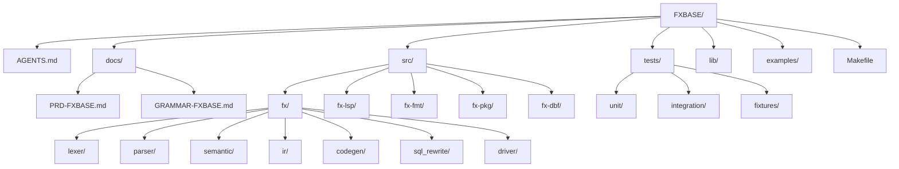
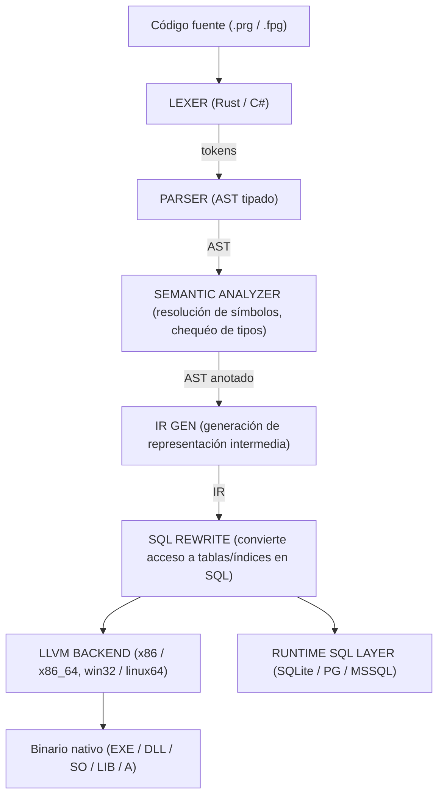

# PRD - FXBASE

**Norma de Referencia:** ISO/IEC/IEEE 29148:2018 (Systems and software engineering — Life cycle processes — Requirements engineering) / ISO/IEC 12207:2017

**Fecha:** 2026-07-29  
**Estado:** Borrador  
**Versión:** 1.0  
**Trazabilidad ID:** REQ-PRD-001  
**Auditoría:** Control de Cambios Fase 0  

---

## 1. Resumen Ejecutivo

FXBASE es un **compilador moderno** compatible con la sintaxis y semántica del lenguaje **xBases** (Clipper, Harbour, FoxPro), pero desacoplado por completo del motor de bases de datos tradicional (.dbf, archivos índice NTX/CDX/IDX). En su lugar, el compilador se integra con **bases de datos relacionales modernas** mediante un driver nativo o un ORM embebido, usando **SQLite** como motor de persistencia predeterminado, y **PostgreSQL** / **Microsoft SQL Server** como motores opcionales para entornos de producción.

El objetivo es permitir que equipos con décadas de código xBase puedan **migrar progresivamente** a una plataforma moderna, con tipado opcional, tooling estándar (LSP, formateador, gestor de paquetes) y despliegue nativo en **Windows y Linux**, generando binarios tanto para **arquitecturas de 32 bits como de 64 bits**.

---

## 2. Motivación y Contexto

- El ecosistema xBase (Clipper, Harbour, FoxPro) tiene **décadas de código legacy** que aún se usa en producción.
- Los motores .dbf e índices NTX/CDX son **obsoletos, lentos, sin concurrencia real y difíciles de mantener**.
- Las empresas necesitan migrar a bases de datos modernas sin **reescribir todo desde cero**.
- No existe un compilador xBase que apunte directamente a SQL/NoSQL como capa de datos nativa.

---

## 3. Objetivos

| # | Objetivo                                                                                                                               |
|---|----------------------------------------------------------------------------------------------------------------------------------------|
| 1 | Compilar sintaxis xBase moderna a código nativo (vía C/C++ o LLVM) o a bytecode con JIT.                                               |
| 2 | Reemplazar `USE`, `INDEX`, `SET ORDER`, etc. por sintaxis SQL o abstracciones equivalentes.                                            |
| 3 | Soportar **SQLite** como motor de persistencia por defecto, y **PostgreSQL** / **SQL Server** como motores opcionales.                 |
| 4 | Mantener compatibilidad hacia atrás con Harbour/Clipper en un subconjunto controlado.                                                  |
| 5 | Proveer tooling moderno: **LSP, formateador, gestor de dependencias, depurador**.                                                      |
| 6 | Generar binarios nativos (EXE) y librerías (**DLL/SO** dinámicas y **LIB/A** estáticas) para **Windows y Linux**, en **32 y 64 bits**. |

---

## 4. Stack Tecnológico Propuesto

| Componente                   | Tecnología                                                                                                                                                                                                                             |
|------------------------------|----------------------------------------------------------------------------------------------------------------------------------------------------------------------------------------------------------------------------------------|
| **Frontend (parser/lexer)**  | Free Pascal — analizador sintáctico **descendente recursivo** escrito a mano sobre un **lexer basado en DFA**. La gramática EBNF se codifica directamente como funciones de parsing, con soporte para *lookahead* y manejo de errores. |
| **IR / Optimizador**         | Free Pascal — IR propio en memoria (árbol/DAG) con pase de optimizaciones: plegado de constantes, eliminación de código muerto, etc.                                                                                                   |
| **Backend (código máquina)** | Free Pascal — generación de código nativo directo a ensamblador x86/x86_64, con targets **Windows** (PE/COFF) y **Linux** (ELF).                                                                                                       |
| **Capa de datos**            | Free Pascal con wrappers nativos para SQLite, PostgreSQL, MSSQL                                                                                                                                                                        |
| **Tooling**                  | LSP (Language Server Protocol), DAP (Debug Adapter Protocol)                                                                                                                                                                           |
| **Empaquetado**              | Generación de EXE, DLL/SO (dinámicas) y LIB/A (estáticas) según plataforma                                                                                                                                                             |

---

## 5. Características Principales

### 5.1 Lenguaje

- Sintaxis compatible con Harbour/Clipper/FoxPro **en un 80 %**.
- Tipado **opcional y gradual** (sistema de tipos parecido a TypeScript): toda variable sin anotación de tipo es **dinámica** (puede cambiar de tipo en runtime). Con anotación `Identifier : DataType`, el compilador valida en tiempo de compilación.

**Tipado dinámico:**

- Las variables declaradas sin tipo (`LOCAL x`) se comportan como en Clipper/Harbour: pueden albergar cualquier tipo y mutar en runtime.
- El compilador infiere el tipo cuando es posible, pero no exige declaración.
- La rigidez se controla por archivo o bloque con directivas: `#strict on`, `#strict off`.
- Coerción automática entre tipos compatibles (ej. `"123" + 456` → `"123456"` como string, igual que en xBASE clásico).
- **Cast explícito** disponible en modo `#strict` o cuando se necesita forzar tipo: `CAST<DataType>(expr)` o `expr AS DataType` (tiempo de compilación, sin runtime overhead).
- La función `ValType()` / `Type()` funciona sobre cualquier variable dinámica.
- Los parámetros de funciones declarados sin tipo son dinámicos; con tipo son chequeados en compilación (si se pasa tipo incorrecto, warning en modo normal, error en modo `#strict`).

**Variables de memoria (MEMVAR):**

FXBASE hereda el sistema de scoping dinámico de Clipper/Harbour pero ofrece alternativas modernas:

| Declaración | Ámbito                                                       | Acceso desde funciones hijas | Recomendado                        |
|-------------|--------------------------------------------------------------|------------------------------|------------------------------------|
| `LOCAL x`   | Bloque/función actual                                        | No                           | **Sí** (ámbito léxico, seguro)     |
| `STATIC x`  | Función/módulo (persiste entre llamadas)                     | No                           | **Sí** (cuando se necesita estado) |
| `PRIVATE x` | Función actual + funciones llamadas (dinámico)               | Sí (crea nueva variable)     | Solo para compatibilidad legacy    |
| `PUBLIC x`  | Global a toda la aplicación                                  | Sí (misma variable global)   | Solo para compatibilidad legacy    |
| `MEMVAR x`  | Declara que `x` se resuelva como variable memoria (no campo) | —                            | Solo para desambiguar con FIELD    |
| `FIELD x`   | Declara que `x` se resuelva como campo de DB                 | —                            | Solo cuando hay ambigüedad         |

**Comportamiento FXBASE por defecto (modo normal):**

- `LOCAL` y `STATIC` tienen ámbito **léxico** (resuelto en compilación), como cualquier lenguaje moderno.
- `PRIVATE` y `PUBLIC` tienen ámbito **dinámico** (resuelto en runtime), manteniendo compatibilidad Clipper.
- Si una variable no está declarada y se asigna, se crea como `PRIVATE` implícita (comportamiento xBASE clásico). Con flag `-a`, se declara automáticamente como `MEMVAR`.
- En modo `#strict on`, toda variable debe declararse explícitamente: `LOCAL`, `PRIVATE`, `PUBLIC` o `STATIC`. Las implícitas dan error.

**Warnings de modernización:**

- `FPW-0105`: `PUBLIC` → usar `STATIC` o `LOCAL` con ámbito controlado
- `FPW-0106`: `PARAMETERS` → usar parámetros formales en la firma
- `FPW-0015`: Variable pública creada implícitamente

**Ejemplo migración:**

```xbase
// Clipper legacy
FUNCTION calc
   PRIVATE x := 10
   RETURN x * 2

// FXBASE moderno
FUNCTION calc(n : INTEGER) : INTEGER
   LOCAL x := n
   RETURN x * 2
```

**Arrays y colecciones:**

| Tipo           | Descripción                                                                                                                               | Ejemplo                                   |
|----------------|-------------------------------------------------------------------------------------------------------------------------------------------|-------------------------------------------|
| `ARRAY`        | Arreglo dinámico unidimensional o multidimensional. Índices base 1 (compatible xBASE). Soporta índices negativos (acceso desde el final). | `a := {1, 2, 3}` / `a[1]`                 |
| `ARRAY` tipado | `ARRAY OF <Type>` — arreglo homogéneo validado en compilación.                                                                            | `LOCAL a : ARRAY OF INTEGER := {1,2,3}`   |
| Matriz         | Arreglo anidado para matrices (2D o N-D).                                                                                                 | `m := {{1,2},{3,4}}` / `m[1][2]`          |
| `HASH` / `MAP` | Diccionario clave→valor (similar a Harbour). Claves pueden ser string, numérico, date, o cualquier tipo.                                  | `h := {"name" => "Juan", "age" => 30}`    |
| `VECTOR`       | Arreglo dinámico optimizado para tipos numéricos (operaciones algebraicas).                                                               | `v := VECTOR {1.0, 2.0, 3.0}`             |
| `RANGE`        | Rango inmutable (inicio, fin, paso).                                                                                                      | `0..10` / `0..10:2`                       |
| `STACK`        | Pila LIFO.                                                                                                                                | `s := STACK{}; s:PUSH(x); s:POP()`        |
| `QUEUE`        | Cola FIFO.                                                                                                                                | `q := QUEUE{}; q:ENQUEUE(x); q:DEQUEUE()` |
| `LIST`         | Lista enlazada.                                                                                                                           | `l := LIST{1,2,3}`                        |
| `SET`          | Conjunto sin duplicados.                                                                                                                  | `s := SET{1,2,3}`                         |

**Funciones de array (compatibles con xBASE):**
`AAdd()`, `AClone()`, `ACopy()`, `ADel()`, `AIns()`, `ASize()`, `ASort()`, `AEval()`, `AScan()`, `ATail()`, `Array()`, `Len()`, `hb_ATail()`, `hb_AReverse()`.

**Extensiones FXBASE:**

- `a:MAP(func)` → `ARRAY` (transforma cada elemento)
- `a:FILTER(func)` → `ARRAY` (filtra elementos)
- `a:REDUCE(func, init)` → valor único
- `a:FIND(val)` → índice o `NIL`
- `a:SLICE(start, end)` → subarreglo
- `a:FLAT()` → aplana arreglo anidado
- `h:KEYS()` → `ARRAY` de claves
- `h:VALUES()` → `ARRAY` de valores

**Tipos de datos nativos FXBASE:**

| Tipo xBASE             | Tipo FXBASE                            | Descripción                              |
|------------------------|-----------------------------------------|------------------------------------------|
| `Character` / `String` | `STRING`                                | Cadena de caracteres (UTF-8)             |
| `Numeric`              | `NUMERIC`, `INTEGER`, `FLOAT`, `DOUBLE` | Numérico con precisión arbitraria o fija |

**Enteros con tamaño explícito:**

| Tipo                | Tamaño                          | Rango                                                  |
|---------------------|---------------------------------|--------------------------------------------------------|
| `INT8` / `BYTE`     | 8 bits signed                   | -128 .. 127                                            |
| `UINT8` / `UBYTE`   | 8 bits unsigned                 | 0 .. 255                                               |
| `INT16` / `SHORT`   | 16 bits signed                  | -32,768 .. 32,767                                      |
| `UINT16` / `USHORT` | 16 bits unsigned                | 0 .. 65,535                                            |
| `INT32` / `INT`     | 32 bits signed                  | -2^31 .. 2^31-1                                        |
| `UINT32` / `UINT`   | 32 bits unsigned                | 0 .. 2^32-1                                            |
| `INT64` / `LONG`    | 64 bits signed                  | -2^63 .. 2^63-1                                        |
| `UINT64` / `ULONG`  | 64 bits unsigned                | 0 .. 2^64-1                                            |
| `INT128`            | 128 bits signed                 | -2^127 .. 2^127-1                                      |
| `UINT128`           | 128 bits unsigned               | 0 .. 2^128-1                                           |
| `Date`              | `DATE`, `DATETIME`, `TIMESTAMP` | Fecha, fecha+hora y timestamp                          |
| —                   | `TIMESTAMP WITH TIME ZONE`      | Timestamp con zona horaria (ISO 8601)                  |
| `Logical`           | `LOGICAL`, `BOOLEAN`            | Booleano                                               |
| `Memo`              | `MEMO`, `TEXT`                  | Texto largo                                            |
| `NIL`               | `NIL`                           | Valor nulo                                             |
| —                   | `BLOB`                          | Datos binarios (archivos, imágenes)                    |
| —                   | `ARRAY`                         | Arreglo multidimensional                               |
| —                   | `HASH` / `MAP`                  | Diccionario clave→valor                                |
| —                   | `OBJECT` / `CLASS`              | Instancia de clase OOP (referencia)                    |
| —                   | `STRUCT`                        | Tipo valor (copia en asignación, stack, sin herencia)  |
| —                   | `CODEBLOCK` / `BLOCK`           | Función anónima (closure)                              |
| —                   | `POINTER`                       | Puntero crudo a memoria (solo EXTERN / `#unsafe`)      |
| —                   | `UNIQUE_PTR<T>`                 | Smart pointer de ownership única (move semantics)      |
| —                   | `SHARED_PTR<T>`                 | Smart pointer con refcount compartido                  |
| —                   | `WEAK_PTR<T>`                   | Smart pointer no owning (rompe ciclos)                 |
| —                   | `SYMBOL`                        | Símbolo (referencia a función/variable por nombre)     |
| —                   | `CURSOR` / `RECORDSET`          | Conjunto de resultados SQL                             |
| —                   | `JSON`                          | Tipo nativo JSON (con parsing y serialización)         |
| —                   | `UUID`                          | Identificador único universal                          |
| —                   | `DECIMAL(p,s)`                  | Decimal de precisión fija (para contabilidad/finanzas) |
| —                   | `BYTES`                         | Secuencia de bytes (compatible con `BLOB`)             |
| —                   | `ENUM`                          | Tipo enumerado                                         |

**Structs (FXBASE):**

`STRUCT` es un tipo valor compuesto, similar a `struct` en C, Record en Pascal o `struct` en Go:

- Se copia en asignación (no referencia, a diferencia de `CLASS`)
- Se aloca en stack por defecto (heap solo si se usa `UNIQUE_PTR<STRUCT>` o `SHARED_PTR<STRUCT>`)
- Sin herencia, sin polimorfismo, sin refcount/GC
- Puede tener métodos (`METHOD` / `INLINE METHOD`) como una clase
- Soporta `ALIGN(n)` para control de empaquetado (esencial para EXTERN/C interop)
- Miembro `PADDING(n)` para relleno manual en structs de interfaz C
- Inicialización posicional: `StructType(expr1, expr2, ...)`
- Acceso a miembros: `variable.miembro`

```xbase
STRUCT Point ALIGN(4)
    x : INTEGER
    y : INTEGER
    PADDING(4)
    color : UINT32
ENDSTRUCT

LOCAL p : Point := Point(10, 20, 0xFF0000)
p.x := 30
```

**Smart Pointers (FXBASE):**

| Tipo            | Descripción                                                                      |
|-----------------|----------------------------------------------------------------------------------|
| `POINTER<T>`    | Puntero crudo, solo accesible en modo `#unsafe` o desde `EXTERN`                 |
| `UNIQUE_PTR<T>` | Puntero de ownership única. Se mueve (no se copia). Se libera al salir de ámbito |
| `SHARED_PTR<T>` | Puntero con conteo de referencias compartido                                     |
| `WEAK_PTR<T>`   | Puntero no owned que evita ciclos de refcount                                    |

Operaciones comunes:

```xbase
LOCAL p : UNIQUE_PTR<MyClass> := UNIQUE_PTR<MyClass>(MyClass())
LOCAL q : SHARED_PTR<MyClass> := MAKE_SHARED<MyClass>(arg1, arg2)
LOCAL w : WEAK_PTR<MyClass> := q

val := p^            -- dereferencia
p.Reset()            -- libera/reasigna
raw := p.Get()       -- obtiene POINTER<T>
IF p.IsNull() ...    -- chequeo de nulidad
```

En modo `--gc:refcount`, `SHARED_PTR` es explícito pero semánticamente equivalente al refcount default.
En modo `--gc:none`, los smart pointers son el mecanismo principal de gestión de memoria segura.

**Genéricos (FXBASE):**

FXBASE soporta tipos, funciones, clases y structs paramétricos con **monomorfización** en compilación (sin runtime overhead, como C++/Rust).

```xbase
// Función genérica
FUNCTION Max<T>(a : T, b : T) : T
    RETURN IIF(a > b, a, b)

// Clase genérica
CLASS Stack<T>
    DATA items : ARRAY OF T
    METHOD Push(item : T)
    METHOD Pop() : T
ENDCLASS

// Struct genérico
STRUCT Pair<T, U>
    first : T
    second : U
ENDSTRUCT

// Uso
LOCAL s : Stack<INTEGER> := Stack<INTEGER>()
s:Push(10)
LOCAL p : Pair<STRING, INTEGER> := Pair<STRING, INTEGER>("age", 30)
```

- Los parámetros genéricos pueden tener restricciones: `T : INTEGER` (solo tipos que cumplan la interface/herencia de `INTEGER`)
- `ARRAY OF T` como azúcar sintáctico para arreglo homogéneo
- Sin wildcards ni varianza por ahora (futura expansión)
- El compilador genera una copia monomórfica por cada combinación de tipos usada

**Tipos personalizados (NEWTYPE):**

`NEWTYPE` crea un tipo distinto (wrapping) sobre cualquier `DataType`. A diferencia de un alias, no es intercambiable con su tipo base:

```xbase
NEWTYPE UserId = INTEGER ENDNEWTYPE
NEWTYPE OrderId = INTEGER ENDNEWTYPE

LOCAL uid : UserId := UserId(123)
LOCAL oid : OrderId := OrderId(456)

uid := oid                    // ERROR: type mismatch
uid := CAST<UserId>(oid)      // OK: cast explícito
raw := CAST<INTEGER>(uid)     // OK: extraer base
```

- Zero-cost en runtime (el tipo desaparece en compilación, solo chequeo en compile-time)
- Soporta genéricos: `NEWTYPE Result<T> = T ENDNEWTYPE`
- Conversión solo vía `CAST` explícito

**Closures y codeblocks:**

FXBASE soporta codeblocks estilo xBASE (`{|x| x * 2}`) y closures multi-statement:

```xbase
LOCAL double : BLOCK := { |n| n * 2 }
LOCAL process : BLOCK := { |a, b|
    LOCAL result := a + b
    Eval(Log, result)
}
```

- Los codeblocks heredan el tipado gradual: sin tipo son dinámicos, con anotación se validan en compilación
- Se pueden pasar como argumentos, almacenar en variables y ejecutar con `Eval()` / `AEval()`

**Yield / generadores:**

Un `FUNCTION` que contiene `YIELD` se compila como generador lazy que retorna `ITERATOR<T>`:

```xbase
FUNCTION Range(start : INTEGER, stop : INTEGER) : INTEGER
    FOR i := start TO stop
        YIELD i
    NEXT
ENDFUNC

FOREACH val IN Range(1, 5)
    ? val           // 1, 2, 3, 4, 5
NEXT
```

- El runtime genera una state machine (como C#/Python)
- `ITERATOR<T>` soporta `FOREACH`, `.NEXT()`, `.RESET()`
- Un `FUNCTION` con `YIELD` no puede usar `RETURN` con valor (solo `RETURN` vacío)

**Parámetros variádicos:**

La función acepta un número variable de argumentos con `...`:

```xbase
FUNCTION Concat(...parts : ARRAY OF STRING) : STRING
    LOCAL result := ""
    FOREACH p IN parts
        result += p
    NEXT
    RETURN result

FUNCTION Log(fmt : STRING, ...args : ARRAY OF DYNAMIC)
    // fmt fijo, args variable
```

- El parámetro variádico se recibe como `ARRAY OF <T>`
- Sin tipo se recibe como `ARRAY` dinámico
- Compatible hacia atrás con `PCount()`/`PValue()` en modo legacy

**Argumentos nombrados (kwargs):**

En llamadas a funciones, se puede pasar argumentos por nombre usando `:=`:

```xbase
FUNCTION Connect(host : STRING, port : INTEGER, ssl : LOGICAL)
    ...

Connect("localhost")                                    // posicional
Connect("localhost", port := 443)                       // mixto
Connect(host := "localhost", port := 443, ssl := .T.)   // nombrados
```

- Los kwargs se resuelven contra el nombre del parámetro formal
- Posicionales deben ir antes que kwargs en la llamada
- Combinado con valores default permite omitir argumentos intermedios

**Entry point y argumentos de línea de comandos:**

El programa arranca por `FUNCTION Main` (o `PROCEDURE Main`). Precedencia:

1. Directiva `#entry Identifier` (override explícito)
2. `FUNCTION Main` / `PROCEDURE Main`
3. Primer `PROCEDURE` del archivo raíz (solo `--legacy`)

`Main` recibe los argumentos CLI como parámetros:

```xbase
// Recomendado: parámetros formales
FUNCTION Main(cFile : STRING, cMode : STRING) AS INTEGER
    ? "Archivo:", cFile, "Modo:", cMode
    RETURN 0

// Variádico para número variable
FUNCTION Main(...args : ARRAY OF STRING) AS INTEGER
    FOR i := 1 TO Len(args)
        ? "Arg", i, "=", args[i]
    NEXT
    RETURN 0
```

**Built-in functions (en `std.fph`):**

| Función     | Retorna                                                   |
|-------------|-----------------------------------------------------------|
| `ArgC()`    | `INTEGER` — número de argumentos (sin contar el programa) |
| `ArgV(n)`   | `STRING` — n-ésimo argumento (0 = nombre del programa)    |
| `Command()` | `STRING` — línea de comandos completa                     |

```xbase
FUNCTION Main AS INTEGER
    ? "Programa:", ArgV(0)
    FOR i := 1 TO ArgC()
        ? "Arg", i, ":", ArgV(i)
    NEXT
    RETURN 0
```

**Extensiones de archivo soportadas:**

| Extensión      | Tipo         | Descripción                                               |
|----------------|--------------|-----------------------------------------------------------|
| `.prg`         | Fuente       | Código fuente principal xBASE                             |
| `.fpg`         | Fuente       | Código fuente FXBASE (permite extensiones modernas)      |
| `.fph`         | Header       | Archivos de cabecera FXBASE (compatibles con `#include`) |
| `.ppo`         | Preprocesado | Salida del preprocesador (generado con `-p`)              |
| `.obj`         | Objeto       | Archivo objeto (compilación intermedia)                   |
| `.lib` / `.a`  | Librería     | Librería estática                                         |
| `.dll` / `.so` | Librería     | Librería dinámica                                         |
| `.exe`         | Ejecutable   | Binario nativo                                            |

**Preprocesador y comandos personalizados:**

- Compatibilidad total con `#command` y `#translate` de Clipper/Harbour.
- `#command <patrón> => <traducción>` — define un comando personalizado que el preprocesador traduce a código xBASE/FXBASE antes de compilar.
- `#translate <patrón> => <traducción>` — similar pero sin necesidad de coincidencia exacta de comando.
- `#xcommand` / `#xtranslate` — variantes que respetan mayúsculas del original.
- Patrones con marcadores `<...>`, partes opcionales `[...]`, repetición `...`, y comodines `<*...*>`.
- Ejemplo:

  ```xbase
  #command ? <list,...> => QOut( <list> )
  #command @ <r>, <c> SAY <msg> ;
              GET <var> => ;
     SayAt( <r>, <c>, <msg> ) ; GetAt( <r>, <c>, <var> )
  ```

- Los comandos personalizados se definen en `.fph` y se incluyen con `#include`.

**Comandos predefinidos de serie (built-in):**
FXBASE incluye un archivo `std.fph` (incluido automáticamente) que define wrappers `#command` para todas las funciones estándar del runtime, permitiendo usar sintaxis de comando xBASE clásica:

| Comando                   | Traducción                |
|---------------------------|---------------------------|
| `? expr`                  | `QOut(expr)`              |
| `?? expr`                 | `QQOut(expr)`             |
| `@ r,c SAY msg`           | `SayAt(r, c, msg)`        |
| `@ r,c GET var`           | `GetAt(r, c, @var)`       |
| `ACCEPT msg TO var`       | `var := Accept(msg)`      |
| `WAIT msg TO var`         | `var := Wait(msg)`        |
| `TEXT TO var`             | bloque `Text...EndText`   |
| `KEYBOARD str`            | `Keyboard(str)`           |
| `RUN cmd`                 | `ShellExecute(cmd)`       |
| `QUIT`                    | `__Quit()`                |
| `CANCEL`                  | `__Cancel()`              |
| `HttpGet(url)`            | `HttpGet(url)`            |
| `TcpConnect(host, port)`  | `TcpConnect(host, port)`  |
| `IniRead(file, sec, key)` | `IniRead(file, sec, key)` |
| `ShellOutput(cmd)`        | `ShellOutput(cmd)`        |
| `TaskCreate(func)`        | `TaskCreate(func)`        |
| `Sleep(ms)`               | `Sleep(ms)`               |

El usuario puede extenderlos creando sus propios `.fph` y usando `#include`.

**Comportamiento de `@ ... SAY / GET`:**

| Comando                   | Traducción                         | Comportamiento                                                                                                                                                                                                                                   |
|---------------------------|------------------------------------|--------------------------------------------------------------------------------------------------------------------------------------------------------------------------------------------------------------------------------------------------|
| `@ r, c SAY expr`         | `SayAt(r, c, expr)`                | Escribe `expr` en la posición `r,c` de la consola o terminal. En **modo consola** usa escape sequences ANSI (Linux) o API de consola (Windows). Si no hay terminal (modo background/daemon), el output se redirige a stdout sin posicionamiento. |
| `@ r, c GET var`          | `GetAt(r, c, @var)`                | Despliega un campo editable en `r,c`. Usa edición de línea con soporte de teclas de edición (Home, End, Del, Ins, flechas).                                                                                                                      |
| `@ r, c SAY expr GET var` | `SayAt(r,c,expr); GetAt(r,c,@var)` | Combinación de ambos.                                                                                                                                                                                                                            |
| `READ`                    | `ReadModal()`                      | Activa la edición secuencial de todos los `GET` pendientes.                                                                                                                                                                                      |

**PICTURE (formato de máscara):**

El `PICTURE` en `SAY`/`GET` acepta **function codes** y **templates**, igual que Clipper:

**Function codes** (precedidos por `@`):

| Código  | Efecto                                                            |
|---------|-------------------------------------------------------------------|
| `@B`    | Alinea numérico a la izquierda                                    |
| `@C`    | Muestra `CR` después de números positivos                         |
| `@D`    | Formato fecha según `SET DATE`                                    |
| `@E`    | Formato fecha europeo (DD/MM/AA)                                  |
| `@R`    | Los caracteres del template no se almacenan (solo máscara visual) |
| `@X`    | Muestra `DB` después de números negativos                         |
| `@Z`    | Muestra `0` como espacios                                         |
| `@(`    | Encierra número negativo entre paréntesis                         |
| `@!`    | Convierte a mayúsculas                                            |
| `@$`    | Muestra signo `$` flotante                                        |
| `@K`    | Selección completa del campo al entrar                            |
| `@S<n>` | Scroll horizontal (campo visible de `n` caracteres)               |

**Templates (caracteres de máscara):**

| Carácter | Efecto en SAY                  | Efecto en GET                      |
|----------|--------------------------------|------------------------------------|
| `X`      | Muestra cualquier carácter     | Acepta cualquier carácter          |
| `Y`      | Muestra `Y`/`N` o `y`/`n`      | Acepta solo `Y`/`N`/`y`/`n`        |
| `9`      | Muestra dígito                 | Solo dígitos (y signo en numérico) |
| `#`      | Muestra dígito, espacio, signo | Dígitos, espacio, signo            |
| `!`      | Convierte a mayúscula          | Convierte a mayúscula              |
| `$`      | Muestra `$` flotante           | —                                  |
| `*`      | Muestra `*` flotante (cheques) | —                                  |
| `.`      | Punto decimal                  | Punto decimal insertado            |
| `,`      | Separador de miles             | Coma insertada                     |

**Ejemplos:**

```xbase
@ 1, 1 SAY "Total:" GET nTotal PICTURE "@( 999,999.99"
@ 2, 1 SAY "Fecha:" GET dFecha PICTURE "@D"
@ 3, 1 SAY "Nombre:" GET cNombre PICTURE "@!"
@ 4, 1 SAY "RUT:" GET cRut PICTURE "@R 99.999.999-!"
```

**Cláusulas de control en GET:**

| Cláusula         | Descripción                                                          | Ejemplo                        |
|------------------|----------------------------------------------------------------------|--------------------------------|
| `WHEN expr`      | El GET solo se edita si `expr` es `.T.`. Si es `.F.`, READ lo salta. | `GET edad WHEN edad >= 18`     |
| `VALID expr`     | Validación al salir del campo. Si `expr` es `.F.`, no permite salir. | `GET email VALID "@" $ email`  |
| `RANGE min, max` | Rango válido para valores numéricos o fecha.                         | `GET nPct RANGE 0, 100`        |
| `PICTURE mask`   | Máscara de formato (function codes + templates).                     | `GET fono PICTURE "9999-9999"` |

**Comportamiento:**

- `WHEN` se evalúa al entrar al campo durante un `READ`. Si retorna `.F.`, el GET se omite y se pasa al siguiente.
- `VALID` se evalúa al intentar salir. Si retorna `.F.`, el cursor se queda en el campo.
- `RANGE` solo aplica a tipos numéricos y fecha. Validación automática tras editar.

**Controles extendidos (GET avanzado):**

FXBASE hereda y extiende los controles de Clipper 5.3:

| Comando                                   | Descripción                                                       |
|-------------------------------------------|-------------------------------------------------------------------|
| `@ r,c GET CHECKBOX var`                  | Casilla de verificación. `var` es `.T.`/`.F.`. Soporta `MESSAGE`. |
| `@ r,c GET LISTBOX var ITEMS aItems`      | Lista de selección. `var` almacena el índice/valor seleccionado.  |
| `@ r,c GET PUSHBUTTON var PROMPT "texto"` | Botón pulsable. `var` recibe el índice al presionarlo.            |
| `@ r,c GET RADIOGROUP var ITEMS aItems`   | Grupo de opciones. `var` almacena el índice seleccionado.         |
| `@ r,c GET TBROWSE var SIZE w, h`         | Tabla/browser navegable. `var` es un objeto TBrowse.              |

En **modo consola**, estos controles se renderizan con caracteres ASCII/Unicode:

- CHECKBOX: `[x]` / `[ ]`
- RADIOGROUP: `(•)` / `( )`
- PUSHBUTTON: `< OK >` / `[Cancel]`
- LISTBOX: lista navegable con flechas
- TBROWSE: tabla con columnas y scroll

En **modo GUI** (futuro): se renderizan como widgets nativos del sistema.

**Nota:** FXBASE extiende los templates clásicos con formatos adicionales:

- `PICTURE "@UTF-8"` — fuerza codificación UTF-8 en el campo
- `PICTURE "@REGEX /patrón/"` — valida contra expresión regular
- `PICTURE "@MASK 9999-9999-9999-9999"` — máscara para tarjetas de crédito, teléfonos, etc.

**Funciones de expresión regular (regex):**

- `RegExMatch(text, pattern)` → `{start, end}` o `NIL` (primera coincidencia)
- `RegExMatchAll(text, pattern)` → array de `{start, end}`
- `RegExTest(text, pattern)` → `.T.` / `.F.` (si hay coincidencia)
- `RegExExtract(text, pattern [, group])` → string extraído o `NIL`
- `RegExExtractAll(text, pattern [, group])` → array de strings
- `RegExReplace(text, pattern, replacement)` → string con reemplazo
- `RegExSplit(text, pattern)` → array de strings
- Flags: `"i"` (insensitive), `"m"` (multiline), `"s"` (dotall), `"x"` (extended)
  - Ej: `RegExMatch(text, pattern, "im")`
- Compatibilidad con sintaxis PCRE (Perl Compatible Regular Expressions)

**Modos de salida controlados por `SET DEVICE`:**

| Dispositivo                      | Comportamiento                                   |
|----------------------------------|--------------------------------------------------|
| `SET DEVICE TO SCREEN` (default) | Salida a terminal/consola con posicionamiento    |
| `SET DEVICE TO PRINTER`          | Salida a impresora (formularios, facturas, etc.) |
| `SET DEVICE TO FILE "out.txt"`   | Salida a archivo de texto                        |

**En entornos GUI** (futuro, fuera del alcance inicial):

- `@ ... SAY` se convertirá en un label/tooltip
- `@ ... GET` en un campo de entrada de texto
- El posicionamiento será relativo al layout del formulario

**Estructuras de control modernas (FXBASE):**
Además de los clásicos `DO WHILE`/`FOR`/`IF`, FXBASE incorpora:

| Construcción           | Descripción                                                | Ejemplo                                    |
|------------------------|------------------------------------------------------------|--------------------------------------------|
| `WHILE ... ELSE`       | El `ELSE` se ejecuta si el bucle termina sin `EXIT`        | `WHILE cond ... ELSE ... END`              |
| `DO ... UNTIL`         | Bucle con condición al final (se ejecuta al menos una vez) | `DO ... UNTIL cond`                        |
| `LOOP ... ENDLOOP`     | Bucle infinito con `BREAK` para salir                      | `LOOP ... IF cond BREAK ENDIF ... ENDLOOP` |
| `FOR ... DOWNTO`       | Bucle decreciente                                          | `FOR i := 10 DOWNTO 1 ... NEXT`            |
| `FOREACH ... ELSE`     | `ELSE` se ejecuta si la colección está vacía               | `FOREACH x IN arr ... ELSE ... NEXT`       |
| `FOREACH k, v IN hash` | Itera hash obteniendo clave y valor                        | `FOREACH k, v IN h ... NEXT`               |
| `FOR ... STEP -1`      | Paso negativo (compatible xBASE, se extiende con `DOWNTO`) | `FOR i := 10 TO 1 STEP -1 ... NEXT`        |

- `USE` redirigido a `SELECT` / `CREATE TABLE` / `INSERT` sobre el motor configurado.
- `INDEX ON ... TAG ...` → creación de índices SQL (vía `CREATE INDEX`).
- `SET RELATION` → `JOIN`.
- `REPLACE`, `APPEND`, `DELETE`, `PACK`, `ZAP` → sentencias `UPDATE`, `INSERT`, `DELETE`, `TRUNCATE`.

### 5.2 Lo que NO se hereda de xBASE

| Característica                           | Motivo                                                                            |
|------------------------------------------|-----------------------------------------------------------------------------------|
| Archivos `.dbf` en runtime               | Toda persistencia es SQL; `.dbf` solo vía `fx-dbf` import/export                 |
| Índices NTX / CDX / IDX                  | Reemplazados por `CREATE INDEX` SQL                                               |
| RDD (Replaceable Database Drivers)       | Innecesario con capa SQL unificada                                                |
| Trabajo por áreas de trabajo (workareas) | Reemplazado por cursores SQL y álgebra relacional                                 |
| `SELECT` numérico (ej. `SELECT 1`)       | Solo `SELECT` por alias de tabla/cursor                                           |
| `GOTO` numérico a número de registro     | No hay registros físicos; se usa `OFFSET` / `WHERE`                               |
| `RECNO()`, `RECCOUNT()`, `LASTREC()`     | Sin sentido sin registro físico; equivalentes vía SQL: `ROW_NUMBER()`, `COUNT(*)` |
| `DBEDIT()` / `BROWSE()`                  | Reemplazado por tooling moderno o librerías UI                                    |
| `SET FORMAT`, `SET PROCEDURE`            | Obsoleto; modo `--legacy` emite warning                                           |
| `CALL` (llamada a binario externo)       | Obsoleto; usar `RUN` o API del sistema                                            |
| `DIR`, `DISPLAY STRUCTURE`, `LIST`       | Reemplazado por comandos del shell o `fx` CLI                                    |
| Macros `&` en contextos de compilación   | Solo en runtime (codeblocks); las macros en declaraciones dan error               |
| Tipado dinámico estricto                 | Se permite, pero se fomenta tipado gradual                                        |
| `BEGIN SEQUENCE` / `RECOVER`             | Compatible, pero se prefiere `TRY`/`CATCH` moderno                                |

### 5.3 Drivers de Base de Datos

| Driver               | Soporte  | Modo                     | Persistencia    |
|----------------------|----------|--------------------------|-----------------|
| SQLite               | Completo | Embebido (fichero `.db`) | **Por defecto** |
| PostgreSQL           | Completo | Conexión TCP/IP          | Opcional        |
| Microsoft SQL Server | Completo | Conexión TCP/IP (TDS)    | Opcional        |
| MySQL / MariaDB      | Futuro   | —                        | Futuro          |

### 5.4 Importación y Exportación de DBF

- Herramienta `fx-dbf` para **importar** archivos `.dbf` (estructura + datos + índices) a SQLite/PostgreSQL/SQL Server.
- Herramienta `fx-dbf` para **exportar** tablas SQL a formato `.dbf` compatible con Clipper/Harbour/FoxPro.
- Soporte de formatos DBF **dBASE III, dBASE IV, FoxPro 2.x** (incluyendo campos memo).
- Conversión automática de tipos: `Numeric` → `INTEGER/REAL`, `Character` → `TEXT`, `Date` → `TEXT/DATE`, `Logical` → `INTEGER/BOOLEAN`.
- La importación respeta índices NTX/CDX y los recrea como índices SQL.

### 5.5 Plataformas Objetivo

- **Sistemas operativos:** Windows (7/10/11/Server) y Linux (kernel ≥ 3.10).
- **Arquitecturas:** x86 (32 bits) y x86_64 (64 bits).
- **Tipos de salida:**
  - **Ejecutables** (EXE) independientes.
  - **Librerías dinámicas:** DLL (Windows) y SO (Linux).
  - **Librerías estáticas:** LIB (Windows) y A (Linux).
- El compilador detecta la plataforma anfitriona y genera el binario correspondiente; soporta **cross-compilation** mediante flags (`--target win32`, `--target linux64`, etc.).
- Los binarios de 32 bits permiten ejecución en hardware legacy y compatibilidad con sistemas embebidos.

### 5.6 Runtime Library (RTL)

- Librería en tiempo de ejecución escrita en Free Pascal que se enlaza a todo binario compilado.
- Incluye: manejo de strings, fechas, memoria, tipos dinámicos, codeblocks, macro-operator (`&`), RDD virtual hacia SQL.
- Los drivers SQLite, PostgreSQL y MSSQL forman parte del runtime como unidades enlazables.
- El runtime es **estático por defecto** (binario standalone); soporte dinámico (DLL/SO) como opción.
- Compatible con los targets 32/64 bits Windows y Linux. Los binarios compilados no requieren instalación externa más que las DLL/SO del driver elegido (excepto SQLite, que va embebido en el runtime).

### 5.7 Funciones de Red

El runtime incluye un módulo de red con API síncrona y asíncrona:

**TCP:**

- `TcpConnect(host, port)` → socket
- `TcpSend(socket, data)` → bytes enviados
- `TcpRecv(socket, bufferSize)` → datos recibidos
- `TcpClose(socket)`
- `TcpListen(port)` → servidor
- `TcpAccept(serverSocket)` → socket de cliente

**UDP:**

- `UdpOpen(port)` → socket
- `UdpSend(socket, data, host, port)`
- `UdpRecv(socket, bufferSize)` → `{data, host, port}`
- `UdpClose(socket)`

**HTTP/HTTPS:**

- `HttpGet(url [, headers])` → `{status, body, headers}`
- `HttpPost(url, body [, headers])` → `{status, body, headers}`
- `HttpPut(url, body [, headers])`
- `HttpDelete(url [, headers])`
- `HttpRequest(method, url, body, headers)` → respuesta completa

**DNS:**

- `DnsResolve(hostname)` → IP string
- `DnsReverse(ip)` → hostname

**Utilidades:**

- `IpLocal()` → IP local
- `MacAddress()` → MAC address
- `Ping(host)` → tiempo de respuesta o `NIL`

**Modo asíncrono** (opcional con `#async`):

- `TcpConnectAsync()`, `HttpGetAsync()`, etc.
- Callbacks o `AWAIT` para manejo de respuestas.

### 5.8 Formatos Soportados

**Importación de datos:**

| Formato                         | Origen                                                       | Función / Herramienta              |
|---------------------------------|--------------------------------------------------------------|------------------------------------|
| DBF (dBASE III, IV, FoxPro 2.x) | Archivo `.dbf` + `.fpt`/`.dbt` (memo)                        | `fx-dbf import`                   |
| CSV                             | Archivo `.csv` (delimitado por coma, tab, punto y coma)      | `CsvImport(file [, options])`      |
| JSON                            | Archivo `.json`                                              | `JsonParse(str)`, `JsonLoad(file)` |
| XML                             | Archivo `.xml`                                               | `XmlParse(str)`, `XmlLoad(file)`   |
| SDF                             | Archivo de texto de ancho fijo (System Data Format, Clipper) | `SdfImport(file, widths)`          |
| SQL                             | Archivo `.sql` con sentencias `INSERT`                       | `SqlImport(file, connection)`      |

**Exportación de datos:**

| Formato | Destino                                   | Función / Herramienta                         |
|---------|-------------------------------------------|-----------------------------------------------|
| DBF     | Archivo `.dbf` (dBASE III/IV, FoxPro 2.x) | `fx-dbf export`                              |
| CSV     | Archivo `.csv`                            | `CsvExport(data, file)`                       |
| JSON    | Archivo `.json`                           | `JsonSerialize(data)`, `JsonSave(data, file)` |
| XML     | Archivo `.xml`                            | `XmlSerialize(data, file)`                    |
| XLSX    | Archivo Excel `.xlsx`                     | `XlsxExport(data, file [, sheetName])`        |
| PDF     | Documento PDF                             | `Report:Export(file, "pdf")`                  |
| HTML    | Archivo HTML con tabla                    | `Report:Export(file, "html")`                 |
| TXT     | Texto plano (delimitado o fijo)           | `Report:Export(file, "txt")`                  |
| SQL     | Archivo `.sql` con `INSERT`               | `SqlExport(connection, file [, tables])`      |

**Serialización de datos:**

| Tipo nativo FXBASE    | Serialización                                           |
|------------------------|---------------------------------------------------------|
| `ARRAY`                | `JsonSerialize(arr)`, `CsvSerialize(arr)`               |
| `HASH`                 | `JsonSerialize(hash)`                                   |
| `JSON` (tipo nativo)   | `ToString()`, `ToFile()`                                |
| `CURSOR` / `RECORDSET` | `Cursor:ToArray()`, `Cursor:ToJson()`, `Cursor:ToCsv()` |

**Configuración:**

| Formato | Lectura                         | Escritura                       |
|---------|---------------------------------|---------------------------------|
| INI     | `IniRead(file, sec, key)`       | `IniWrite(file, sec, key, val)` |
| ENV     | `EnvLoad(file)` / `EnvGet(key)` | `EnvSet(key, val)`              |
| JSON    | `JsonLoad(file)`                | `JsonSave(data, file)`          |
| XML     | `XmlLoad(file)`                 | `XmlSave(data, file)`           |

### 5.9 Puertos Serie y Dispositivos

**Puerto serie (RS-232 / RS-422 / RS-485):**

- `SerialOpen(port, baudRate [, config])` → handle
  - Parámetros: `port` → `"COM1"` (Win), `"/dev/ttyS0"` (Linux), `"/dev/ttyUSB0"` (USB-serial), `"/dev/ttyAMA0"` (RPi)
  - `baudRate`: `1200`, `2400`, `4800`, `9600`, `19200`, `38400`, `57600`, `115200`, `230400`, `460800`, `921600`
  - `config`: `{"dataBits" => 8, "stopBits" => 1, "parity" => "none", "flowControl" => "none", "timeout" => 1000}`
  - `parity`: `"none"`, `"odd"`, `"even"`, `"mark"`, `"space"`
  - `flowControl`: `"none"`, `"rts/cts"`, `"xon/xoff"`
- `SerialWrite(handle, data)` → bytes escritos
- `SerialRead(handle, bufferSize [, timeout])` → datos recibidos o `NIL`
- `SerialReadLine(handle [, timeout])` → línea hasta `\n`
- `SerialReadUntil(handle, delimiter [, timeout])` → datos hasta delimitador
- `SerialFlush(handle)` — vacía buffer de entrada/salida
- `SerialSet(handle, config)` — cambia parámetros en caliente
- `SerialClose(handle)`
- `SerialPorts()` → array de puertos disponibles (`["COM1","COM2"]` / `["/dev/ttyS0","/dev/ttyUSB0"]`)
- `SerialStatus(handle)` → `{cts, dsr, ri, dcd, tx, rx}` (estado de líneas)

**RS-485 (modo half-duplex con control de driver):**

- `Serial485Set(handle, enable)` — activa/desactiva modo RS-485
- `Serial485SetTurnaround(delayUs)` — tiempo de conmutación Tx/Rx en microsegundos

### 5.10 Sistema de Tareas (Task / Job)

FXBASE incorpora un sistema de tareas para ejecución en background, scheduler y paralelismo:

**Task API básica:**

- `TaskCreate(func, ...params)` → task ID
- `TaskStart(taskId)` → inicia ejecución
- `TaskWait(taskId [, timeout])` → espera resultado
- `TaskCancel(taskId)`
- `TaskStatus(taskId)` → `"running"`, `"done"`, `"error"`, `"cancelled"`
- `TaskResult(taskId)` → valor retornado por la tarea
- `TaskIsRunning(taskId)` → `.T.` / `.F.`

**Task avanzada:**

- `TaskNew(workBlock [, options])` → objeto Task
  - `task:Start()`, `task:Wait()`, `task:Cancel()`
  - `task:OnComplete(callback)`, `task:OnError(callback)`
  - `task:Progress()` → porcentaje (0..100)
- `TaskParallel({task1, task2, ...})` → espera todas
- `TaskRace({task1, task2, ...})` → espera la primera en terminar
- `TaskChain({func1, func2, ...})` → ejecuta en serie, cada una recibe el resultado de la anterior

**Scheduler (cron-like):**

- `SchedulerEvery(interval, func)` → cada N segundos
- `SchedulerOnce(datetime, func)` → ejecuta una vez en fecha/hora
- `SchedulerCron(cronExpr, func)` → expresión cron estándar
- `SchedulerCancel(jobId)`
- `SchedulerList()` → tareas programadas

**Thread pool (paralelismo real):**

- `ThreadPool(size)` → pool con N hilos
- `pool:Enqueue(func, ...params)` → encola trabajo
- `pool:Stop()` → detiene el pool
- `ParallelFor(start, end, func)` → paraleliza un bucle

**Ejemplo:**

```xbase
t := TaskCreate({|| HttpGet("https://api.example.com/data")})
TaskStart(t)
// ... mientras la tarea corre ...
result := TaskWait(t, 5000)  // espera máx 5 seg
IF result != NIL
    ? result:body
ENDIF
```

### 5.9 Llamadas al Sistema Operativo

FXBASE extiende significativamente lo que xBASE clásico ofrecía:

**Procesos externos:**

- `RUN "comando"` / `!"comando"` (compatible xBASE)
- `ShellExecute(cmd [, args])` → exit code
- `ShellOpen(file)` → abre con programa asociado (ej. `ShellOpen("doc.pdf")`)
- `ShellOutput(cmd [, args])` → captura stdout como string
- `ShellOutputLines(cmd [, args])` → captura stdout como array de líneas
- `ProcessCreate(cmd [, args])` → PID
- `ProcessWait(pid [, timeout])` → exit code
- `ProcessKill(pid)`
- `ProcessExists(pid)` → `.T.` / `.F.`
- `ProcessList()` → array de `{pid, name}`

**Ambiente:**

- `GetEnv(name)` → valor o `NIL` (compatible xBASE)
- `SetEnv(name, value)` → establece variable de entorno
- `GetEnvList()` → hash con todas las variables
- `UserName()` → usuario actual
- `HostName()` → nombre del host
- `OsName()` → `"Windows"` o `"Linux"`
- `OsVersion()` → versión del SO
- `Arch()` → `"x86"` o `"x86_64"`
- `Uptime()` → segundos desde inicio del sistema
- `SysError()` / `SysError(n)` → obtiene/establece código de error del sistema

**Archivos y sistema de archivos:**

- Compatibilidad total con funciones xBASE: `File()`, `FOpen()`, `FClose()`, `FRead()`, `FWrite()`, `FSeek()`, `FCreate()`, `FErase()`, `FRename()`, `Directory()`, `CurDir()`, `DirChange()`, `DirMake()`, `DirRemove()`, `DiskSpace()`, `DiskName()`
- Extensiones FXBASE:
  - `FileCopy(src, dst [, overwrite])`
  - `FileMove(src, dst)`
  - `FileSize(path)` → bytes
  - `FileTime(path)` → timestamp
  - `FileAttr(path)` → atributos
  - `FileExists(path)` → `.T.`/`.F.` (similar a `File()` pero con ruta completa)
  - `DirList(path [, mask])` → array de nombres
  - `DirTree(path)` → array recursivo
  - `PathJoin(parts...)` → combinación de rutas
  - `PathSplit(path)` → `{dir, name, ext}`
  - `TempFile([ext])` → ruta temporal única
  - `TempDir()` → directorio temporal del sistema
  - `FileReadAll(path)` → string completo (una llamada)
  - `FileWriteAll(path, content)` → escribe string completo

**Registro y configuración:**

- `RegRead(key, name)` → lee valor del registro (Windows) o `NIL`
- `RegWrite(key, name, value)` → escribe valor
- `RegDelete(key, name)`

**Archivos de configuración (.ini / .env):**

INI:

- `IniRead(file, section, key [, default])` → valor string
- `IniWrite(file, section, key, value)` → escribe/crea entrada
- `IniDelete(file, section [, key])` → elimina sección o clave
- `IniSections(file)` → array de secciones
- `IniKeys(file, section)` → array de claves
- Soporta comentarios `;` y `#`

ENV:

- `EnvLoad(file)` → carga archivo `.env` al entorno del proceso
- `EnvGet(key [, default])` → lee variable de entorno (equivalente a `GetEnv`)
- `EnvSet(key, value)` → establece variable
- `EnvUnset(key)` → elimina variable
- `EnvFile()` → ruta del `.env` por defecto (busca desde CWD hacia arriba)
- Formato soportado: `KEY=value`, `# comentarios`, comillas dobles/simples, expansión `${VAR}`

**Tiempo del sistema:**

- `Date()`, `Time()`, `Seconds()` (compatible xBASE)
- `Now()` → timestamp actual
- `NowUtc()` → timestamp UTC
- `CpuTime()` → tiempo de CPU del proceso actual
- `TickCount()` → milisegundos desde inicio del sistema
- `Sleep(ms)` → pausa el hilo actual

### 5.10 Gestión de Memoria

- **Recolección de basura (GC) generacional** basado en el recolector de Free Pascal.
- Modos configurables por compilación:
  - `--gc:refcount` — conteo de referencias (default, determista, sin pausas)
  - `--gc:generational` — GC generacional con compactación (mejor para apps con mucha creación de objetos)
  - `--gc:none` — sin GC, gestión manual con `ALLOCATE()` / `DEALLOCATE()` o smart pointers (`UNIQUE_PTR`, `SHARED_PTR`, `WEAK_PTR`)
- Coexistencia: los objetos nativos FXBASE (arrays, hashes, strings) usan refcount automático; los objetos `CLASS` pueden elegirse entre refcount o manual; los `STRUCT` siempre son sin GC (tipo valor).
- El runtime libera automáticamente al salir del ámbito (como Harbour).
- `GcCollect()` → forzar recolección
- `GcStats()` → `{totalMem, usedMem, objects, cycles}`

### 5.11 Concurrencia e Hilos

- **Mutex:**
  - `MutexCreate()` → mutex handle
  - `MutexLock(mutex [, timeout])` → `.T.`/`.F.`
  - `MutexUnlock(mutex)`
  - `MutexDestroy(mutex)`

- **Semáforos:**
  - `SemaphoreCreate(initialCount)` → sem handle
  - `SemaphoreWait(sem [, timeout])`
  - `SemaphoreSignal(sem)` / `SemaphorePost(sem)`
  - `SemaphoreDestroy(sem)`

- **Variables compartidas:**
  - `ThreadLocal(name [, value])` → variable por hilo
  - `AtomicIncrement(var)` / `AtomicDecrement(var)` → operaciones atómicas
  - `AtomicExchange(var, newValue)` → intercambio atómico
  - `AtomicCompareExchange(var, expected, newValue)` → CAS

- **Barreras y condiciones:**
  - `BarrierCreate(count)` → barrera de sincronización
  - `BarrierWait(barrier)`
  - `CondVarCreate()` → variable de condición
  - `CondVarWait(cv, mutex [, timeout])`
  - `CondVarSignal(cv)` / `CondVarBroadcast(cv)`

- **Canales (comunicación entre tareas):**
  - `ChannelCreate([bufferSize])` → canal con/sin buffer
  - `ChannelSend(ch, value [, timeout])`
  - `ChannelRecv(ch [, timeout])` → valor o `NIL`
  - `ChannelClose(ch)`
  - `ChannelTrySend(ch, value)` / `ChannelTryRecv(ch)` → no bloqueantes

### 5.12 Reportes e Informes

- Compatibilidad con `REPORT FORM` / `LABEL FORM` (modo legacy).
- **Nuevo motor de informes FXBASE:**
  - `ReportCreate(template)` → objeto Report desde string XML/JSON
  - `ReportLoad(file)` → carga plantilla desde archivo
  - `report:SetDataSource(cursor)` → vincula a consulta SQL o array
  - `report:SetParameter(name, value)` → parámetros
  - `report:Run()` → genera informe
  - `report:Export(path, format)` → exporta a PDF, HTML, XLSX, CSV, TXT

- **Reportes programáticos:**
  - `ReportBuilder()` → objeto para construir informes en código
  - `rb:AddSection(type)`, `rb:AddField(expr, label)`, `rb:AddGroup(expr)`
  - `rb:SetTitle()`, `rb:SetFooter()`, `rb:SetPageSize()`
  - `rb:Run()` → genera salida

### 5.13 Unicode e Internacionalización

- **Strings UTF-8 por defecto** en toda la RTL.
- Funciones string compatibles xBASE (`Left()`, `Right()`, `SubStr()`, `At()`, `Len()`, etc.) operan sobre **caracteres Unicode**, no bytes.
- Modo legacy `--db-ansi` para comportamiento byte-wise xBASE clásico.
- `AnsiToUtf8(str)`, `Utf8ToAnsi(str)`, `Utf8Len()`, `Utf8SubStr()`, `Utf8Pos()`

- **Locale / i18n:**
  - `SetLocale(locale)` → ej. `"es_ES"`, `"en_US"`, `"de_DE"`
  - `GetLocale()` → locale actual
  - `LocaleDate(format)` → fecha formateada según locale
  - `LocaleNumber(n, format)` → número formateado según locale
  - `CollateCompare(str1, str2)` → comparación con collation del locale

- **Traducciones:**
  - `TextDomain(domain)` → dominio de traducción (gettext-compatible)
  - `GetText(msgid)` → traducción o msgid si no existe
  - `BindTextDomain(domain, path)` → directorio de `.mo` / `.po`

### 5.14 Extend System (Llamadas a C)

- `ExtLoad(libName)` → carga librería compartida (`.dll`/`.so`)
- `ExtSym(lib, symbol)` → obtiene puntero a función
- `ExtCall(funcPtr, params...)` → llama función externa
- `ExtFree(lib)` → descarga librería

- **Declaración de funciones externas:**

  ```xbase
  EXTERN FUNCTION MessageBox(hWnd, text, caption, type) => INT;
      LIB "user32.dll"
  ```

  - Tipos C mapeables: `INT`, `LONG`, `SHORT`, `CHAR`, `DOUBLE`, `POINTER`, `STRING` (PChar), `HANDLE`
  - `LIB "..."` especifica la DLL/SO
  - `PASCAL` / `CDECL` / `STDCALL` para convención de llamada

### 5.15 Depuración (DAP + Depurador Embebido)

- **`fx-dap`** — servidor Debug Adapter Protocol para integración con VS Code, Emacs, etc.

**Depurador interactivo embebido (estilo Clipper):**

- Invocable en runtime vía:
  - `AltD()` — función tradicional Clipper (abre depurador si está compilado con `-g`)
  - `DbgBreak()` — punto de ruptura programático
  - `SET KEY Alt+D TO DbgStart()` — tecla configurable
  - Al producirse un error no controlado, se abre automáticamente
- Ventana de depuración con:
  - **Call stack** (pila de llamadas) navegable
  - **Variables locales, privadas, públicas, estáticas** con valores en vivo
  - **Watch list** personalizable
  - **Breakpoints** por línea/archivo/función/condición
  - **Evaluación de expresiones** en contexto actual
- Controles: Step Over, Step Into, Step Out, Continue, Run to Cursor, Restart
- Inspección de arrays, hashes y objetos (expandible en árbol)
- Depuración remota vía DAP para entornos headless/servidor
- Compilar con `-g` (info completa) o `-g:line` (solo líneas)

**Niveles de compilación para debug:**

- `-g` — información de depuración completa (DWARF en Linux, CODEVIEW en Windows)
- `-g:line` — solo números de línea
- `-g:none` — sin debug info
- `--dap` — modo servidor DAP

### 5.16 Perfilado y Optimizaciones

**Niveles de optimización:**

| Flag  | Descripción                                                                             |
|-------|-----------------------------------------------------------------------------------------|
| `-O0` | Sin optimización (default en debug)                                                     |
| `-O1` | Optimizaciones básicas: plegado de constantes, eliminación de código muerto             |
| `-O2` | Optimizaciones completas: inline, loop unrolling, eliminación de subexpresiones comunes |
| `-Os` | Optimizar por tamaño de binario                                                         |
| `-Oz` | Optimizar agresivamente por tamaño                                                      |
| `-Og` | Optimizaciones que no interfieren con debug                                             |
| `-O3` | Máxima optimización (puede aumentar tamaño)                                             |

**Perfilado:**

- `-p` / `--profile` — instrumenta el binario para profiling
- `--profile-cycles` — mide ciclos de CPU
- `--profile-memory` — mide uso de memoria
- `ProfileStart()`, `ProfileStop()` → control en runtime
- `ProfileDump(file)` → escribe resultados a archivo
- `ProfileReset()` → reinicia contadores

### 5.17 Testing Unitario

- Framework integrado en el runtime, sin dependencias externas.

- `TestSuite(name)` → crea suite de tests
  - `suite:AddTest(name, block)`
  - `suite:Run()` → ejecuta todos
  - `suite:Results()` → `{passed, failed, errors, total}`
  - `suite:Report()` → texto con resumen

- Aserciones:
  - `AssertEq(expected, actual [, msg])`
  - `AssertNe(notExpected, actual [, msg])`
  - `AssertTrue(expr [, msg])`
  - `AssertFalse(expr [, msg])`
  - `AssertNil(val [, msg])`
  - `AssertNotNil(val [, msg])`
  - `AssertType(val, typeName [, msg])`
  - `AssertError(block [, expectedMsg])` → espera que lance error
  - `AssertNoError(block)` → espera que NO lance error

- Ejecución desde CLI:

  ```text
  fx test tests/          # ejecuta todos los tests en el directorio
  fx test tests/mi_test.fpg --verbose
  ```

### 5.18 Seguridad y Criptografía

**Hash:**

- `HashMd5(data)` → string hex MD5
- `HashSha1(data)` → SHA-1
- `HashSha256(data)` → SHA-256
- `HashSha512(data)` → SHA-512
- `HashBcrypt(data, rounds)` → BCrypt hash
- `HashVerify(data, hash)` → verifica contra BCrypt
- `HashHmac(data, key, algo)` → HMAC-SHA256/512
- `HashFile(path, algo)` → hash de archivo

**Cifrado:**

- `CipherEncrypt(algo, key, data [, iv])` → datos cifrados
- `CipherDecrypt(algo, key, data [, iv])` → datos descifrados
- Algoritmos: `"AES-128"`, `"AES-256"`, `"AES-256-GCM"`, `"ChaCha20"`, `"ChaCha20-Poly1305"`
- `CipherKeyGen(algo)` → genera clave aleatoria
- `CipherIvGen(algo)` → genera vector de inicialización

**TLS / SSL:**

- `TlsConnect(host, port [, options])` → socket TLS
- `TlsSend(socket, data)`
- `TlsRecv(socket, bufferSize)`
- `TlsClose(socket)`
- Soporte para certificados: `TlsCertLoad(certFile, keyFile)`, `TlsCertVerify(cert)`

**Aleatoriedad:**

- `Random()` → `FLOAT` entre 0.0 y 1.0
- `RandomInt(min, max)` → `INT` entre min y max
- `RandomBytes(n)` → array de bytes aleatorios seguros
- `RandomUuid()` → UUID v4 aleatorio

**Utilerías:**

- `Base64Encode(data)` / `Base64Decode(str)`
- `HexEncode(data)` / `HexDecode(str)`
- `UrlEncode(str)` / `UrlDecode(str)`
- `JwtEncode(payload, secret, algo)` → JWT token
- `JwtDecode(token, secret)` → payload o `NIL`

### 5.19 Empaquetado y Deploy

| Formato            | Plataforma | Descripción                                            |
|--------------------|------------|--------------------------------------------------------|
| Binario standalone | Win/Linux  | EXE con runtime y SQLite embebido (default)            |
| DLL / SO           | Win/Linux  | Librería dinámica con runtime separable                |
| LIB / A            | Win/Linux  | Librería estática para enlace externo                  |
| MSI                | Windows    | Instalador con recursos, dependencias y acceso directo |
| AppDir / AppImage  | Linux      | Formato portable AppImage (opcional)                   |
| Tar.gz / Zip       | Win/Linux  | Distribución comprimida del binario + dependencias     |

- `fx build --release` → compila con `-O2` sin debug info
- `fx build --dist msi` → genera MSI (Windows)
- `fx build --dist appimage` → genera AppImage (Linux)
- `fx build --dist zip` → genera archivo comprimido portable
- `fx deploy --server user@host:/path` → sube binario y reinicia servicio

### 5.20 Licenciamiento

| Componente                     | Licencia                                       |
|--------------------------------|------------------------------------------------|
| Compilador `fx`               | MIT                                            |
| Runtime (RTL)                  | MIT — permite enlace en proyectos propietarios |
| Drivers DB                     | MIT (SQLite: dominio público, PG/MSSQL: MIT)   |
| Tooling (LSP, DAP)             | MIT                                            |
| Documentación                  | Creative Commons BY 4.0                        |
| `std.fph` y librerías estándar | MIT                                            |

- Sin requisito de compartir código fuente del usuario.
- Sin cláusulas virales.
- Licencia única para uso comercial y privado.

### 5.21 Sistema de Eventos (Pub-Sub)

FXBASE incluye un bus de eventos desacoplado para comunicación entre componentes:

- `EventBusCreate([name])` → bus de eventos
- `EventBusDefault()` → bus global por defecto
- `EventSubscribe(bus, eventName, callback [, filter])` → subscription ID
- `EventUnsubscribe(bus, subId)`
- `EventPublish(bus, eventName, data)` → dispara evento
- `EventPublishAsync(bus, eventName, data)` → dispara asíncrono
- `EventOnce(bus, eventName, callback)` → suscripción de una sola vez

**Características:**

- Eventos nombrados con jerarquía (`"db.insert"`, `"http.request"`, `"task.complete"`)
- Filtros por patrón: `"db.*"` recibe todos los eventos DB
- Callbacks reciben `{name, data, timestamp, source}`
- Cola por prioridad: `EventPublish(bus, name, data, priority)`
- `EventClear(bus [, eventName])` — limpia suscriptores

**Ejemplo:**

```xbase
bus := EventBusCreate("app")
EventSubscribe(bus, "user.login", {|ev| LogEvent(ev:data:user)})
EventPublish(bus, "user.login", {"user" => "admin"})
```

### 5.22 Códigos de Error del Compilador

Los errores del compilador siguen el formato `FPX-nnnn`, agrupados por categoría:

| Código     | Categoría     | Descripción                                                |
|------------|---------------|------------------------------------------------------------|
| `FPX-0001` | Léxico        | Carácter no esperado                                       |
| `FPX-0002` | Léxico        | String no terminado                                        |
| `FPX-0003` | Léxico        | Comentario bloque no cerrado                               |
| `FPX-0004` | Léxico        | Literal numérico mal formado                               |
| `FPX-0005` | Léxico        | Identificador demasiado largo (> 256 chars)                |
| `FPX-0101` | Sintaxis      | Token no esperado (error general de parsing)               |
| `FPX-0102` | Sintaxis      | Falta `ENDIF` / `ENDDO` / `NEXT` / `ENDCASE`               |
| `FPX-0103` | Sintaxis      | `ELSE` / `ELSEIF` fuera de `IF`                            |
| `FPX-0104` | Sintaxis      | `CASE` / `OTHERWISE` fuera de `SWITCH` o `DO CASE`         |
| `FPX-0105` | Sintaxis      | `LOOP` / `EXIT` fuera de bucle                             |
| `FPX-0106` | Sintaxis      | `RECOVER` fuera de `BEGIN SEQUENCE`                        |
| `FPX-0107` | Sintaxis      | Expresión mal formada (ej. operador sin operandos)         |
| `FPX-0108` | Sintaxis      | Paréntesis no balanceados                                  |
| `FPX-0109` | Sintaxis      | `END` sin estructura que cerrar                            |
| `FPX-0201` | Semántica     | Variable no declarada (modo `#strict`)                     |
| `FPX-0202` | Semántica     | Tipo incompatible en asignación (modo `#strict`)           |
| `FPX-0203` | Semántica     | Parámetro incorrecto en llamada a función                  |
| `FPX-0204` | Semántica     | Símbolo duplicado (variable/función ya definida)           |
| `FPX-0205` | Semántica     | Función o procedimiento no encontrado                      |
| `FPX-0206` | Semántica     | `RETURN` fuera de función/procedimiento                    |
| `FPX-0207` | Semántica     | División por cero en constante                             |
| `FPX-0208` | Semántica     | Miembro de clase no existe                                 |
| `FPX-0301` | Preprocesador | `#include` no encontrado                                   |
| `FPX-0302` | Preprocesador | `#define` sin identificador                                |
| `FPX-0303` | Preprocesador | Directiva desconocida                                      |
| `FPX-0304` | Preprocesador | Anidamiento excesivo de includes (> 32 niveles)            |
| `FPX-0305` | Preprocesador | Error en patrón `#command` / `#translate`                  |
| `FPX-0401` | SQL           | Error de sintaxis SQL en `EXECUTE SQL`                     |
| `FPX-0402` | SQL           | Error de conexión a base de datos                          |
| `FPX-0403` | SQL           | Tabla no encontrada en el motor configurado                |
| `FPX-0404` | SQL           | Comando DB xBASE no traducible a SQL                       |
| `FPX-0501` | Linker        | Símbolo externo no resuelto                                |
| `FPX-0502` | Linker        | Biblioteca no encontrada                                   |
| `FPX-0503` | Linker        | Error de formato de archivo objeto                         |
| `FPX-0504` | Linker        | Entry point no definido                                    |
| `FPX-0601` | Runtime       | Error de ejecución (índice de array fuera de rango)        |
| `FPX-0602` | Runtime       | Violación de acceso a memoria                              |
| `FPX-0603` | Runtime       | Desbordamiento de pila                                     |
| `FPX-0604` | Runtime       | Error de archivo (no encontrado / permiso denegado)        |
| `FPX-0605` | Runtime       | Error de red (conexión fallida / timeout)                  |
| `FPX-0606` | Runtime       | Error de base de datos (query fallida)                     |
| `FPX-0607` | Runtime       | Error de cifrado (clave inválida / algoritmo no soportado) |
| `FPX-0608` | Runtime       | Error de tipo (ValType inesperado)                         |
| `FPX-0609` | Runtime       | Error de tarea (task cancelada / timeout)                  |
| `FPX-0410` | Semántica     | `OVERRIDE` sin método `VIRTUAL` correspondiente en clase base |
| `FPX-0411` | Semántica     | `OVERRIDE` reduce visibilidad del método base              |
| `FPX-0412` | Semántica     | Firma de override no coincide con método base (covarianza no soportada) |
| `FPX-0413` | Semántica     | Instancia de clase `ABSTRACT` no permitida                 |
| `FPX-0414` | Semántica     | Método `ABSTRACT` no implementado en clase concreta        |
| `FPX-0415` | Semántica     | Clase `FINAL`/`SEALED` no admite herencia                  |
| `FPX-0416` | Semántica     | Método `FINAL` no admite override                          |
| `FPX-0417` | Semántica     | `IMPLEMENTS` sin cumplir contrato de interfaz              |
| `FPX-0418` | Semántica     | `INTERFACE` con `DATA` o cuerpo de método (no permitido)   |
| `FPX-0419` | Semántica     | Acceso a miembro vía `SUPER::` sin clase base válida       |

### 5.23 Warnings del Compilador

Los warnings siguen el formato `FPW-nnnn` y se emiten en modo normal; en `--legacy` algunos son errores:

| Código     | Descripción                                                     |
|------------|-----------------------------------------------------------------|
| `FPW-0001` | Variable declarada pero no usada                                |
| `FPW-0002` | Variable usada sin inicializar                                  |
| `FPW-0003` | Asignación a variable de tipo incompatible (coerción implícita) |
| `FPW-0004` | Función sin `RETURN`                                            |
| `FPW-0005` | Parámetro no usado                                              |
| `FPW-0006` | Comparación entre tipos distintos                               |
| `FPW-0007` | Código muerto tras `RETURN` / `EXIT` / `LOOP`                   |
| `FPW-0008` | `#command` definido pero nunca usado                            |
| `FPW-0009` | Uso de construcción obsoleta (modo normal)                      |
| `FPW-0010` | Macro `&` en contexto donde podría evitarse                     |
| `FPW-0011` | Conversión implícita de string a número                         |
| `FPW-0012` | Anidamiento excesivo (> 20 niveles)                             |
| `FPW-0013` | Reasignación de tipo a variable tipada                          |
| `FPW-0014` | Llamada a función sin usar el valor de retorno                  |
| `FPW-0015` | Variable pública creada implícitamente                          |
| `FPW-0016` | Uso de `GOTO` numérico (no recomendado)                         |
| `FPW-0017` | Modo `--legacy` activo (se acepta sintaxis obsoleta)            |
| `FPW-0018` | Sentencia DB traducida a SQL no exactamente equivalente         |

**Warnings de modernización (sugieren usar sintaxis FXBASE moderna):**

| Código     | Sintaxis clásica            | Sugerencia FXBASE                                 |
|------------|-----------------------------|----------------------------------------------------|
| `FPW-0101` | `DO WHILE ... ENDDO`        | Usar `WHILE ... END`                               |
| `FPW-0102` | `DO CASE ... ENDCASE`       | Usar `SWITCH ... ENDSWITCH`                        |
| `FPW-0103` | `STORE x TO v1, v2`         | Usar `v1 := v2 := x`                               |
| `FPW-0104` | `DECLARE arr[n]`            | Usar `LOCAL arr := Array(n)` o `LOCAL arr : ARRAY` |
| `FPW-0105` | `PUBLIC x`                  | Usar `STATIC` o `LOCAL` con ámbito controlado      |
| `FPW-0106` | `PARAMETERS x, y`           | Usar `FUNCTION f(x, y)` con parámetros formales    |
| `FPW-0107` | `ACCEPT msg TO v`           | Usar `v := Input(msg)`                             |
| `FPW-0108` | `WAIT msg TO v`             | Usar `v := Wait(msg)`                              |
| `FPW-0109` | `INPUT msg TO v`            | Usar `v := Input(msg)`                             |
| `FPW-0110` | `TEXT TO v ... ENDTEXT`     | Usar asignación de string multilínea               |
| `FPW-0111` | `FOR i := 1 TO n` simple    | Usar `FOREACH` si se itera una colección           |
| `FPW-0112` | `REPLACE`                   | Usar asignación directa `field := value`           |
| `FPW-0113` | `APPEND BLANK` / `REPLACE`  | Usar `INSERT INTO` SQL                             |
| `FPW-0114` | `SET FILTER TO`             | Usar cláusula `WHERE` en SQL                       |
| `FPW-0115` | `SET RELATION TO`           | Usar `JOIN` en SQL                                 |
| `FPW-0116` | `RUN cmd`                   | Usar `ShellExecute(cmd)` o `ShellOutput(cmd)`      |
| `FPW-0117` | `CALL proc`                 | Usar `proc()` (llamada directa)                    |
| `FPW-0118` | `FIND str`                  | Usar `SEEK expr` o consulta SQL                    |
| `FPW-0119` | `SEEK expr` sobre DB        | Usar `SELECT ... WHERE` SQL                        |
| `FPW-0120` | `GO n` / `GOTO n`           | Usar `ORDER BY` + `LIMIT` / `OFFSET` SQL           |
| `FPW-0121` | `SKIP n`                    | Usar cursor SQL `FETCH`                            |
| `FPW-0122` | `DELETE` / `RECALL`         | Usar `UPDATE ... SET deleted =` SQL                |
| `FPW-0123` | `PACK` / `ZAP`              | Usar `DELETE FROM` / `TRUNCATE` SQL                |
| `FPW-0124` | `AVERAGE` / `SUM` / `COUNT` | Usar `SELECT AVG()/SUM()/COUNT()` SQL              |
| `FPW-0125` | `SET INDEX TO`              | Usar `CREATE INDEX` SQL                            |
| `FPW-0126` | `LOCATE` / `CONTINUE`       | Usar `SELECT ... WHERE` SQL                        |
| `FPW-0127` | `SORT TO`                   | Usar `SELECT ... ORDER BY` SQL                     |
| `FPW-0128` | `TOTAL ON`                  | Usar `SELECT ... GROUP BY` SQL                     |

Estos warnings se pueden **deshabilitar** individualmente si el proyecto prefiere mantener el estilo xBASE clásico.

Control de warnings:

- `-w` — habilita todos los warnings
- `-w+` — trata warnings como errores
- `-w-` — suprime warnings
- `-w=FPW-0001,FPW-0003` — suprime warnings específicos
- `#pragma warning disable FPW-0001`
- `#pragma warning restore FPW-0001`

### 5.3 Tooling

- **fx** — CLI del compilador (build, run, test).

  Parámetros del compilador `fx`:

  | Parámetro              | Descripción                                       |
  |------------------------|---------------------------------------------------|
  | `build`                | Compila el código fuente a binario nativo         |
  | `run`                  | Compila y ejecuta directamente                    |
  | `test`                 | Compila y ejecuta tests                           |
  | `-o <path>`            | Directorio de salida del binario                  |
  | `--target <arch>`      | `win32`, `win64`, `linux32`, `linux64`            |
  | `--db <engine>`        | `sqlite` (default), `postgresql`, `mssql`         |
  | `--connection <str>`   | Cadena de conexión a la base de datos             |
  | `--output-type <tipo>` | `exe` (default), `dll`, `so`, `lib`, `a`          |
  | `--static`             | Enlace estático del runtime (default)             |
  | `--dynamic`            | Enlace dinámico del runtime (DLL/SO)              |
  | `--legacy`             | Acepta sintaxis Clipper/Harbour 100% con warnings |
  | `--entry <name>`       | Función o procedimiento de entrada                |
  | `--incdir <path>`      | Directorio de includes                            |
  | `--libdir <path>`      | Directorio de librerías                           |
  | `-D <macro>[=valor]`   | Define macro de preprocesador                     |
  | `-i <path>`            | Añade directorio de búsqueda de includes          |
  | `-n`                   | No generar procedimiento implícito de inicio      |
  | `-a`                   | Declaración automática de memvars                 |
  | `-m`                   | Compilar módulo solamente (sin enlazar)           |
  | `-p`                   | Generar salida preprocesada (`.ppo`)              |
  | `-v`                   | Modo verbose                                      |
  | `--version`            | Muestra versión del compilador                    |
  | `--help`               | Muestra ayuda                                     |

- **fx-lsp** — Language Server Protocol (diagnósticos, completado, ir a definición).
- **fx-fmt** — Formateador de código.
- **fx-pkg** — Gestor de paquetes (p. ej. `fx install csv-lib`).

---

## 5.A Roadmap — Compatibilidad xBase Estratificada (Estrategia 80/20)

> **Estado:** Roadmap — pendiente de implementación. Detalle operativo y herramientas de migración en `docs/COMPATIBILITY-STRATEGY.md`. Estado actual por tier:
>
| Tier | Componentes                                                                                         | Implementado                                                                                |
|------|-----------------------------------------------------------------------------------------------------|---------------------------------------------------------------------------------------------|
| T1   | Lexer case-insensitive, `IF/ENDIF`, `DO WHILE/ENDDO`, `FOR/NEXT`, `?`, `??`                         | Parcial (lexer + parser + IR para control de flujo; `@…SAY/GET` requiere `fx.rtl` no-stub) |
| T2   | Traducción `USE/SKIP/SEEK/GO TOP/EOF/BOF/REPLACE/PACK/ZAP` → SQL sobre RDD virtual                  | No (tokens lexados; parser reconoce sintaxis; lowering IR→RTL pendiente)                    |
| T3   | Restricción de `&` macro a identificadores y expresiones simples; promoción a codeblocks `{|a, b| …}` | No (lexer entrega `&` como `ttAmp` sin transformación)                                      |

FXBASE ofrece **tres tiers opt-in** de compatibilidad con código xBASE legacy. La estrategia es explícitamente estratificada: en cada tier se asume un porcentaje de compatibilidad decreciente a cambio de ganancias en modernidad, predictibilidad y optimización.

### 5.A.1 Tier 1 — Sintaxis y control de flujo (~95 %)

- **Soporte completo e insensibilidad a mayúsculas/minúsculas** para comandos legacy (`IF/ENDIF`, `DO WHILE/ENDDO`, `FOR/NEXT`, `@ … SAY/GET`, `?`, `??`).
- **Eliminación de la regla de abreviación de comandos a 4 letras** (exigir palabras clave completas para mantener el lexer limpio). Razón: en xBASE clásico, `DECLARE` admitía `DECL`, `PROCEDURE` admitía `PROC`, etc. FXBASE exige la palabra completa para reducir el espacio de tokens y eliminar ambigüedad entre dialectos.

### 5.A.2 Tier 2 — Datos y RDD virtual (Sintaxis ~80 % / Binaria 0 %)

- **Desmantelamiento en compile-time** de los comandos clásicos de navegación (`USE`, `SKIP`, `SEEK`, `GO TOP/BOTTOM`, `APPEND BLANK`, `REPLACE`, `EOF()`, `BOF()`, `PACK`, `ZAP`) y redirección a una **capa RDD Virtual** sobre motores SQL (SQLite, PostgreSQL, MSSQL).
- **Compatibilidad binaria con archivos físicos `.dbf/.cdx/.ntx/.fpt`: explícitamente obsoleta.** Estado runtime: solo SQL. Solo `fx-dbf` (CLI) puede importar schema/datos `.dbf` → SQL o exportar una tabla SQL → `.dbf` para interoperabilidad.
- **Herramienta de migración** incluida: `fx-dbf import` / `fx-dbf export` (ver `docs/COMPATIBILITY-STRATEGY.md` §5).

### 5.A.3 Tier 3 — Evaluación dinámica de macros (`&`)

- **Restricción** de la macroevaluación en runtime mediante `&` a **resolución de identificadores** o **expresiones simples aisladas** (`USE &tablename`, `? FIELD&fname`).
- **Promoción** del uso de **Bloques de Código** (`{|a, b| …}`) y **lambdas** para garantizar la optimización **AOT** (Ahead-Of-Time). Las macros complejas (`&macro.{}`, `&macro.()`, `&macro.field`, `&macro->method`) se marcan como **FPW-LEG-0002** y se rechazan en `--strict`.
- **Razón:** las macros `&` requieren emitir código que evalúe la expresión en runtime, lo que imposibilita análisis estático de tipos, inline, constant folding y verificación de seguridad.

### 5.A.4 Referencias cruzadas

- Gramática de directivas: `docs/GRAMMAR-FXBASE.md` §3.6 (`#pragma strict` / `#strict`).
- EBNF de smart pointers y tipos valor vs referencia: `docs/GRAMMAR-FXBASE.md` §5.A.
- RTL multi-modelo de memoria: `docs/PARALLEL-COMPILER-ARCHITECTURE.md` §"Gestión de Memoria en el Runtime".
- Prefetching de cursores SQL: `docs/PARALLEL-COMPILER-ARCHITECTURE.md` §"Optimización RDD SQL".

---

## 5.B Roadmap — Tipado Gradual y Directivas de Estrictez

> **Estado:** Roadmap — pendiente de implementación. No hay directivas `#pragma strict` ni `#strict` activas en `fx.preprocessor.pas`.

FXBASE implementa un sistema de tipos **opcional y gradual** similar al de TypeScript: las variables sin anotación de tipo se infieren como `VARIANT` (o `ANY`), y la rigidez se activa por archivo o bloque.

### 5.B.1 Sintaxis de la directiva

```xbase
#pragma strict(ON | OFF)    // Forma canónica, preferida
#strict ON                  // Forma abreviada (legacy xBASE)
#strict OFF
```

### 5.B.2 Semántica

| Modo        | `LOCAL x` (sin tipo) | `LOCAL x : INTEGER` | Cast runtime           |
|-------------|----------------------|---------------------|------------------------|
| `#strict OFF` (legacy) | `VARIANT` / `ANY`, libre mutación  | Asignación validada | Implícito (coerción)    |
| `#strict ON`  | **Error: tipo requerido** (FPX-T-0103) | Validado en compile-time | Exige `AS` o `CAST<T>()` |

### 5.B.3 Estado actual del tipado

- **Lexer:** acepta `:` y `AS` como tokens (`ttColon`, `kwAs`); parser maneja `LOCAL x AS TYPE` desde el commit de Phase 1.1.
- **Backend de tipos:** la propiedad `TFunctionDef.ReturnType` y los accesos `TVarDeclStmt.GetType(i)` ya existen en `fx.ast.pas`, pero el lowering IR no los valida aún.
- **Implementación completa:** Fase 2.5 del roadmap.

---

## 5.C Roadmap — Tipos Valor vs Referencia y Smart Pointers

> **Estado:** Roadmap — pendiente de implementación. Los tokens `kwStruct`, `kwClass`, `kwUnique_ptr`, `kwShared_ptr`, `kwWeak_ptr` **existen** en `fx.tokens.pas`/`fx.lexer.pas`, pero el parser no los procesa como modificadores semánticos (sin distinción stack/heap, sin ownership tracking).

### 5.C.1 STRUCT vs CLASS

| Forma                                | Asignación | Lifetime                                  |
|--------------------------------------|------------|-------------------------------------------|
| `STRUCT Foo … ENDSTRUCT`             | **Stack** (valor, copia por asignación)  | Léxico (RAII)                             |
| `CLASS Foo … ENDCLASS`               | **Heap** (referencia, alias por copia)  | Refcount + cycle detection (default)      |
| `CLASS Foo … ENDCLASS WITH NO GC`    | **Heap** sin GC                           | Manual (FFI / interop C/FPC)              |

### 5.C.2 Smart pointers

| Modificador                  | Modelo de ownership                       | Uso típico                                  |
|------------------------------|-------------------------------------------|---------------------------------------------|
| `UNIQUE_PTR<T>`              | Exclusivo, transferible                   | Recursos críticos (archivos, sockets, locks) |
| `SHARED_PTR<T>`              | Compartido, refcount                      | Recursos compartidos entre hilos/módulos    |
| `WEAK_PTR<T>`                | Observador no-propietario                 | Cache, callbacks, romper ciclos de referencia |

**Sintaxis propuesta:**

```xbase
LOCAL file : UNIQUE_PTR<HANDLE> := UniquePtr{HANDLE, OpenFile("data.bin")}
LOCAL cache : SHARED_PTR<HashTable> := SharedPtr{HashTable}
LOCAL weak_cache : WEAK_PTR<HashTable> := WeakPtr{HashTable}

IF weak_cache.LOCK() != NIL THEN
   ? weak_cache.LOCK()["key"]
ENDIF
```

### 5.C.3 RTL multi-modelo (referencia)

FXBASE elegirá el modelo de memory management en compile-time según el tipo declarado:

| Tipo                          | Modelo de memoria (RTL)               |
|-------------------------------|---------------------------------------|
| `CLASS Foo`                   | RefCount + cycle detection (default)  |
| `CLASS Foo WITH NO GC`        | Manual / RAII                          |
| `STRUCT Foo`                  | RAII (lifetime léxico)                 |
| `TASK` / `CHANNEL`            | Generational GC o region-based allocator |
| `UNIQUE_PTR<T>` / `SHARED_PTR<T>` | RefCount intrínseco              |
| Código FFI C/Free Pascal      | Manual (`ALLOCATE` / `DEALLOCATE`)     |

Detalle arquitectónico en `docs/PARALLEL-COMPILER-ARCHITECTURE.md` §"Gestión de Memoria en el Runtime (RTL)".

---

## 6. Migración desde Código xBase Legacy

### 6.1 Compatibilidad hacia atrás

- Modo `--legacy` que acepta sintaxis 100 % Clipper/Harbour pero emite **warnings** por cada construcción obsoleta.
- Tabla de equivalencias automática para `USE`, `SELECT`, `SET INDEX`, `SET ORDER`.

### 6.2 Estrategia de migración

1. El usuario importa sus .dbf a SQLite con `fx-dbf import --input datos.dbf --output data.db`.
2. El compilador compila el código Harbour con `fx build --db sqlite --connection "data.db"`.
3. Una vez validado, se cambia la cadena de conexión a PostgreSQL o SQL Server para producción.
4. Si es necesario, se exportan los datos de vuelta a .dbf con `fx-dbf export --input data.db --output datos.dbf`.

---

## 7. Estructura del Repositorio



## 8. Arquitectura del Compilador (Alto Nivel)



---

## 9. Ejemplo Conceptual

```xbase
// Código FXBASE
USE "clientes" ALIAS c
INDEX ON c->apellido TAG apellido
SET ORDER TO apellido
SEEK "García"
? c->nombre, c->apellido
```

Compilado con `fx build --db sqlite --connection "data.db"` generaría equivalente a:

```sql
-- Tabla clientes creada automáticamente (si no existe)
CREATE TABLE IF NOT EXISTS clientes (
    apellido TEXT,
    nombre   TEXT,
    ...
);
CREATE INDEX IF NOT EXISTS idx_clientes_apellido ON clientes(apellido);

-- SELECT con filtro
SELECT nombre, apellido FROM clientes WHERE apellido = 'García' LIMIT 1;
```

---

## 9. Métricas de Éxito

1. **Compatibilidad:** Poder compilar sin errores al menos el 80 % del código Harbour de proyectos reales.
2. **Rendimiento:** Las consultas SQL sobre SQLite deben ser **≥ 2× más rápidas** que las mismas operaciones en .dbf nativo.
3. **Migración:** Herramienta `fx-dbf` capaz de migrar una base .dbf completa (estructura + datos) a SQLite/PG/MSSQL en **menos de 60 segundos para 1 GB de datos**.
4. **Import/Export:** Soporte completo de ida y vuelta (DBF → SQL → DBF) sin pérdida de tipos ni datos.

---

## 10. Roadmap Tentativo

| Fase  | Hito                                                                          | Duración estimada |
|-------|-------------------------------------------------------------------------------|-------------------|
| **0** | Parser + Lexer + AST para subconjunto básico del lenguaje                     | 3 meses           |
| **1** | Generación de IR y backend LLVM con targets x86 y x86_64 para Windows y Linux | 3 meses           |
| **2** | Runtime SQL con driver SQLite embebido                                        | 2 meses           |
| **3** | Drivers PostgreSQL y SQL Server                                               | 2 meses           |
| **4** | Tooling (LSP, formateador, CLI completo)                                      | 2 meses           |
| **5** | Herramienta `fx-dbf` (import/export DBF), modo legacy, documentación         | 2 meses           |

---

## 11. Riesgos y Mitigaciones

| Riesgo                            | Impacto | Mitigación                                                                 |
|-----------------------------------|---------|----------------------------------------------------------------------------|
| Compatibilidad con Harbour < 80 % | Alto    | Priorizar el subconjunto más usado (manejo de tablas, condiciones, ciclos) |
| Rendimiento SQL vs .dbf nativo    | Medio   | Cache de resultados, prepared statements, batch inserts                    |
| Fragmentación de sintaxis xBase   | Medio   | Tabla de dialectos configurables (Clipper / FoxPro / Harbour)              |

---

## 12. Glosario

| Término             | Definición                                                           |
|---------------------|----------------------------------------------------------------------|
| **xBases**          | Familia de lenguajes derivados de dBASE (Clipper, FoxPro, Harbour)   |
| **PRG**             | Extensión típica de los archivos fuente en Harbour/Clipper           |
| **NTX / CDX / IDX** | Formatos de índice propietarios de .dbf                              |
| **LSP**             | Language Server Protocol (estándar de tooling para editores)         |
| **LLVM**            | Infraestructura de compilador para generar código máquina optimizado |

---

## 13. Propietario del Documento

**Autor:** Equipo FXBASE  
**Contacto:** —  
**Próxima revisión:** 2026-09-01
