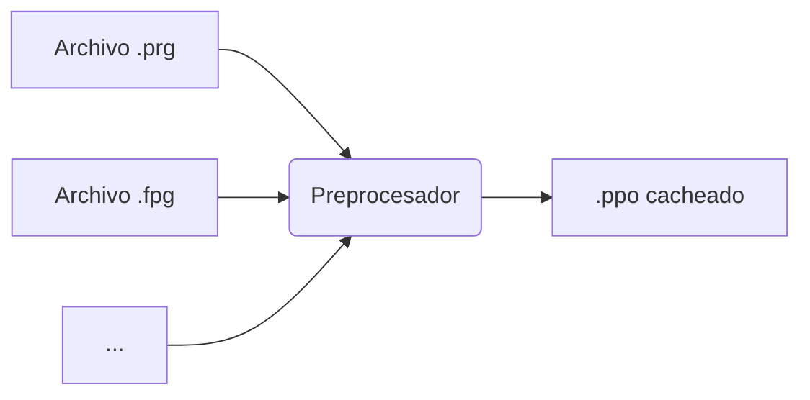
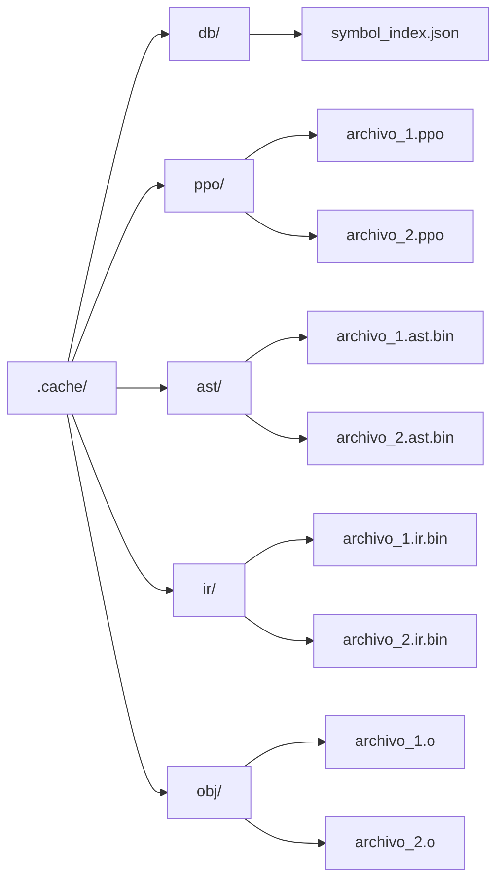
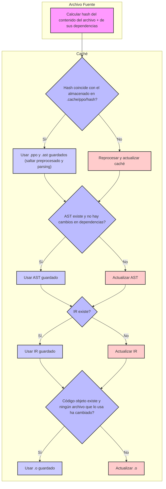
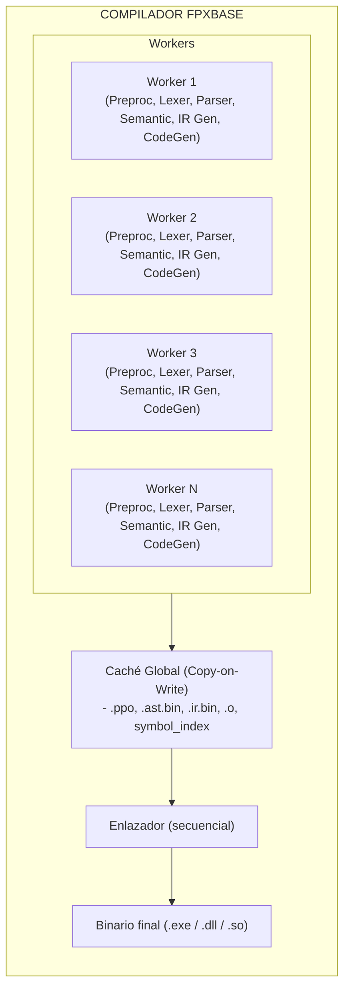

# PARALLEL-COMPILER-ARQUITECTURE

**Norma de Referencia:** ISO/IEC/IEEE 29148:2018 / ISO/IEC/IEEE 15288:2015 (Systems and software engineering — System life cycle processes)

**Fecha:** 2026-07-30  
**Estado:** Borrador  
**Versión:** 1.0  
**Trazabilidad ID:** ARC-PCA-001  
**Auditoría:** Control de Diseño de Arquitectura

## 🏗️ Arquitectura General del Compilador FPXBASE (Orientada a Velocidad)

Vamos a rediseñar el pipeline clásico (Lexer → Parser → Semántica → IR → Codegen) con un enfoque **paralelo y cacheable**, adaptado a las características de XBase (múltiples archivos `.prg`/`.fpg`, preprocesador potente, sentencias DB).

### 1. Fase de Preprocesamiento Distribuido

**Desafío**: El preprocesador de XBase (`#command`, `#translate`) es Turing-completo y dependiente del orden de inclusión de archivos.

**Estrategia**:

| Acción                              | Detalle                                                                                                                                                                   |
|-------------------------------------|---------------------------------------------------------------------------------------------------------------------------------------------------------------------------|
| **Preprocesado por archivo**        | Cada archivo fuente se preprocesa de forma **independiente** en un hilo de trabajo. Esto es posible porque las macros se expanden en el ámbito del archivo.               |
| **Caché de archivos preprocesados** | Guardar el resultado `.ppo` (preprocesado) en disco. Si el archivo fuente y sus dependencias `#include` no han cambiado, se reutiliza el `.ppo` sin volver a preprocesar. |
| **Detección de cambios**            | Usar `mtime` + hash de contenido de los archivos fuente y los `.fph` incluidos.                                                                                           |

**Flujo**:



---

### 2. Análisis Léxico y Sintáctico en Paralelo

**Desafío**: Lexer y Parser son tareas que, aunque en teoría son secuenciales por archivo, son **independientes entre archivos**.

**Estrategia**:

| Componente               | Implementación                                                                                                                                                                                           |
|--------------------------|----------------------------------------------------------------------------------------------------------------------------------------------------------------------------------------------------------|
| **Lexer**                | DFA basado en tablas (como los generados por `re2c` o manual en FPC). Cada hilo ejecuta su propio lexer sobre el archivo preprocesado.                                                                   |
| **Parser**               | Recursive Descent (como especifica el PRD). Cada hilo construye su propio AST para el archivo que procesa.                                                                                               |
| **Pool de trabajadores** | El compilador tiene un pool de N hilos (donde N = número de núcleos lógicos - 1, dejando uno para el sistema). Cada hilo toma un archivo de la cola de trabajos, lo lexea, lo parsea y construye el AST. |

**Métrica de rendimiento**: Idealmente, el tiempo de parsing total es `T_total = max(T_archivo_más_grande)` en lugar de `Σ T_archivos`, asumiendo que hay suficientes archivos para saturar todos los núcleos.

---

### 3. Análisis Semántico (Resolución de Símbolos y Tipado)

**Desafío**: Este es el paso más **acoplado** porque necesita resolver símbolos globales (funciones, variables públicas, clases) que pueden estar en otros archivos.

**Estrategia**:

| Subfase                                         | Implementación                                                                                                                                                             | Paralelización                                                                                |
|-------------------------------------------------|----------------------------------------------------------------------------------------------------------------------------------------------------------------------------|-----------------------------------------------------------------------------------------------|
| **Construcción de tablas de símbolos globales** | Se procesan todos los ASTs de los archivos en un **único pase secuencial** para construir un índice global de símbolos exportados (funciones, clases, variables públicas). | ⚠️ **Secuencial** (pero rápido si se hace con estructuras de datos eficientes como hash maps). |
| **Verificación de tipos por archivo**           | Una vez que la tabla global está construida, cada archivo puede verificar sus tipos y referencias a símbolos globales **de forma independiente** en hilos separados.       | ✅ **Paralelo** por archivo.                                                                   |
| **Inferencia de tipos**                         | Si está en modo `#strict`, la inferencia se hace en el pase por archivo. Si es modo dinámico, se saltea.                                                                   | ✅ **Paralelo** por archivo.                                                                   |

---

### 4. Generación de IR y Optimización (Middle-end)

**Desafío**: La generación de IR es naturalmente paralelizable por archivo.

**Estrategia**:

| Tarea                                                | Implementación                                                                                                                                                      | Paralelización                         |
|------------------------------------------------------|---------------------------------------------------------------------------------------------------------------------------------------------------------------------|----------------------------------------|
| **Generación de IR**                                 | Cada archivo genera su propio IR (árbol/DAG) a partir de su AST anotado semánticamente.                                                                             | ✅ **Paralelo** por archivo.            |
| **Optimizaciones locales**                           | Constant folding, DCE (Dead Code Elimination), inlining de funciones pequeñas dentro del mismo archivo.                                                             | ✅ **Paralelo** por archivo.            |
| **Optimizaciones globales (Link-time optimization)** | Si se habilita `-O3`, se puede hacer un pase de optimización global (como inlining entre archivos) al final, pero esto es opcional y puede hacerse en un solo hilo. | ⚠️ **Secuencial** (opcional y costoso). |

---

### 5. Generación de Código (Backend)

**Desafío**: Este es el cuello de botella clásico. La generación de código máquina es costosa en CPU.

**Estrategia**:

| Tarea                                     | Implementación                                                                                                                   | Paralelización                                                                          |
|-------------------------------------------|----------------------------------------------------------------------------------------------------------------------------------|-----------------------------------------------------------------------------------------|
| **Generación de ensamblador por archivo** | Cada archivo IR se convierte a ensamblador x86/x86_64 (o se genera código objeto directamente usando un backend como el de FPC). | ✅ **Paralelo** por archivo.                                                             |
| **Ensamblado y enlazado**                 | Los archivos objeto `.obj`/`.o` se enlazan en un solo binario al final.                                                          | ⚠️ **Secuencial** (pero el enlazado es normalmente mucho más rápido que la compilación). |

**Estrategia avanzada**: Usar **compilación en paralelo con LTO (Link-Time Optimization) diferida**:

- Generar código objeto **sin optimizar** en paralelo.
- En el enlace, hacer optimizaciones globales en un solo hilo (opcional).

---

## 🧵 Diseño del Pool de Hilos y Cola de Trabajos

Para aprovechar todos los núcleos, implementamos un **sistema de tareas con productor-consumidor**:

```pascal
type
  TWorkItem = record
    FileName: string;
    Source: string;         // Código preprocesado
    AST: PASTNode;          // Árbol sintáctico (se llena en parse)
    IR: PIRNode;            // Representación intermedia
    Asm: string;            // Código ensamblador generado
    ObjFile: string;        // Ruta del objeto generado
    Status: (wsPending, wsParsing, wsSemantic, wsIR, wsCodegen, wsDone, wsError);
    ErrorMsg: string;
  end;

  TWorkQueue = class
    Items: array of TWorkItem;
    Mutex: TMutex;
    CondVar: TCondVar;
    function Pop(): TWorkItem;  // Bloqueante
    procedure Push(item: TWorkItem);
  end;

  TWorkerThread = class(TThread)
    procedure Execute; override;
  end;
```

**Pipeline de un worker**:

```mermaid
graph TD
    A[Tomar archivo de la cola (wsPending)] --> B{Preprocesar (si no está cacheado)};
    B -- Sí --> C[Preprocesado → wsParsing];
    B -- No --> D[Usar caché];
    C --> E[Lexer + Parser → AST → wsSemantic];
    D --> E;
    E --> F{Resolver símbolos (si la tabla global está lista)};
    F -- Sí --> G[Resolver símbolos → wsIR];
    F -- No --> H[Esperar tabla global];
    G --> I[Generar IR → wsCodegen];
    H --> I;
    I --> J[Generar ensamblador/código objeto → wsDone];
```

---

## 🧠 Estrategia de Caché (Incrementalidad)

El compilador debe ser **incremental por diseño** para que las compilaciones posteriores sean "a la velocidad de la luz".

### Estructura de Caché



### Flujo de Compilación Incremental



### Sincronización en Entornos Paralelos

Usamos el modelo **Copy-on-Write** (como rustc):

- Cada hilo trabaja con una **copia de solo lectura** de la caché global.
- Cuando un hilo termina un trabajo (ej. genera un .ppo), **publica** el resultado en la caché global.
- Los demás hilos pueden leer el resultado publicado sin esperar.

---

## 🚀 Optimizaciones Específicas para XBase

### Traducción de DB a SQL

La traducción de `USE`, `REPLACE`, `INDEX`, etc. a SQL es una de las partes más costosas del compilador.

**Estrategia**:

- **Caché de esquemas**: Cada `USE "tabla"` se traduce a un `SELECT * FROM tabla` con el esquema de la tabla. El esquema se cachea en `.cache/db/schema_<tabla>.json`.
- **Prepared statements**: Las consultas SQL generadas se cachean como prepared statements (en el runtime, no en el compilador).
- **Traducción por archivo**: Cada archivo traduce sus sentencias DB de forma independiente, en paralelo.

### Expansión de Macros (`#command`)

Las macros son costosas de procesar.

**Estrategia**:

- **Caché de expansión**: Guardar el resultado de `#command`/`#translate` en el `.ppo`.
- **Expansión perezosa**: Solo expandir las macros que se usan realmente en el archivo.

---

## 📊 Diagrama de Arquitectura Final



---

## 🔧 Implementación Práctica en Free Pascal

### Threading en FPC

Free Pascal tiene soporte nativo para hilos:

```pascal
uses
  Classes, SysUtils, SyncObjs;

type
  TCompilerWorker = class(TThread)
  private
    FQueue: TWorkQueue;
    FResult: TWorkItem;
  protected
    procedure Execute; override;
  public
    constructor Create(AQueue: TWorkQueue);
  end;

constructor TCompilerWorker.Create(AQueue: TWorkQueue);
begin
  inherited Create(False);
  FQueue := AQueue;
  FreeOnTerminate := True;
end;

procedure TCompilerWorker.Execute;
var
  item: TWorkItem;
begin
  while not Terminated do
  begin
    item := FQueue.Pop();  // Bloquea si no hay trabajo
    if item.FileName = '' then Break;
    try
      // Fase 1: Preprocesar (si no está cacheado)
      item.Source := PreprocessFile(item.FileName);

      // Fase 2: Lexer + Parser → AST
      item.AST := ParseFile(item.Source);

      // Fase 3: Análisis semántico (esperar tabla global si es necesario)
      WaitForGlobalSymbolTable();
      ResolveSymbols(item.AST);

      // Fase 4: Generar IR
      item.IR := GenerateIR(item.AST);

      // Fase 5: Generar código objeto
      item.ObjFile := GenerateCode(item.IR);

      // Publicar en caché
      UpdateCache(item);

      FResult := item;
    except
      on E: Exception do
      begin
        item.Status := wsError;
        item.ErrorMsg := E.Message;
      end;
    end;
  end;
end;
```

### Sincronización con la Tabla de Símbolos Global

La tabla de símbolos global debe construirse antes de que los workers puedan hacer el análisis semántico.

**Estrategia**:

1. **Fase 0** (secuencial): Recorrer todos los archivos y extraer símbolos exportados (funciones, clases, variables públicas). Esto es muy rápido (solo es un escaneo superficial).
2. **Fase 1** (paralela): Cada worker procesa su archivo, resolviendo símbolos contra la tabla global (que ya está construida y es de solo lectura durante esta fase).

```pascal
type
  TSymbolTable = class
    Functions: TDictionary<string, TFunctionInfo>;
    Classes: TDictionary<string, TClassInfo>;
    PublicVars: TDictionary<string, TVarInfo>;
  end;

var
  GlobalSymbolTable: TSymbolTable;
  SymbolTableLock: TMultiReadExclusiveWriteSynchronizer;
```

### Control de Hilos

El compilador debe detectar automáticamente el número de núcleos:

```pascal
function GetCoreCount: Integer;
begin
  {$IFDEF UNIX}
  Result := TThread.ProcessorCount;
  {$ELSE}
  Result := TThread.ProcessorCount;  // Windows también
  {$ENDIF}
  if Result < 1 then Result := 1;
end;
```

Flag del compilador: `--jobs N` para permitir al usuario ajustar manualmente.

---

## 📈 Métricas de Rendimiento Esperadas

| Escenario                                    | Tiempo (sin paralelo) | Tiempo (con paralelo, 8 cores) | Speedup  |
|----------------------------------------------|-----------------------|--------------------------------|----------|
| Compilación limpia (100 archivos, 10k LOC)   | 10 segundos           | **1.5 segundos**               | **6.6x** |
| Compilación incremental (1 archivo cambiado) | 0.5 segundos          | **0.1 segundos**               | **5x**   |
| Preprocesado de 100 archivos                 | 3 segundos            | **0.5 segundos**               | **6x**   |

---

## ✅ Resumen de Estrategias Clave

1. **Paralelización por archivo**: Cada archivo es una unidad de trabajo independiente.
2. **Caché incremental**: Guardar `.ppo`, `.ast`, `.ir`, `.o` para compilaciones futuras.
3. **Copy-on-Write para caché**: Los hilos pueden leer y publicar sin bloqueos largos.
4. **Tabla de símbolos global construida en un pase rápido secuencial**, luego solo lectura.
5. **Pool de hilos** con número de workers = núcleos disponibles.
6. **Traducción DB → SQL** cacheada por esquema de tabla.
7. **Backend nativo de FPC** aprovechado para generación de código (reutilizando su pipeline).

Este diseño te permite cumplir con el PRD, el roadmap, y además hacer que el compilador sea **increíblemente rápido** incluso en máquinas con muchos núcleos.
